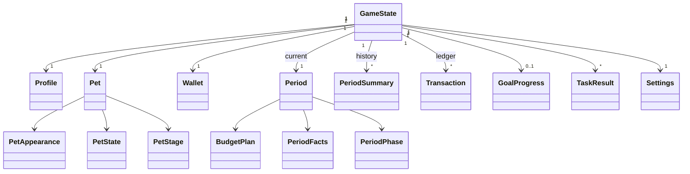

# 02 — Доменная модель

Все сущности ниже — чистый Kotlin без зависимостей от Android. Они живут в модуле `:domain`
(см. [06](06-architecture.md)) и сериализуются целиком как один агрегат `GameState`.

## Схема



Справочники (контент, только чтение): `Item`, `Task`, `Goal`, `PetSpecies`, `PetColor`, `EconomyConfig`.
Они загружаются из JSON и в `GameState` попадают только по `id` (см. [05](05-content-model.md)).

## GameState — корневой агрегат

Единственный объект, который сохраняется на диск и который меняет игровой движок.
Любая команда пользователя — это функция `(GameState, Command) → Outcome`, где `Outcome`
содержит новый `GameState` и список объяснений для экрана (см. [06](06-architecture.md#api-игрового-движка-контракт-между-разработчиками)).

```kotlin
@Serializable
data class GameState(
    val schemaVersion: Int = 1,
    val profile: Profile,
    val pet: Pet,
    val wallet: Wallet,
    val period: Period,                       // текущий период
    val history: List<PeriodSummary> = emptyList(),
    val ledger: List<Transaction> = emptyList(),
    val goal: GoalProgress? = null,           // null — цель ещё не выбрана
    val completedGoals: List<CompletedGoal> = emptyList(),
    val taskResults: List<TaskResult> = emptyList(),
    val settings: Settings = Settings(),
)
```

Инварианты, которые проверяет тест `GameStateInvariantsTest` после каждой команды:

- `wallet.balance >= 0` и `wallet.savings >= 0`.
- `wallet.balance == сумма balanceDelta по ledger`, `wallet.savings == сумма savingsDelta по ledger`.
- `period.index == history.size + 1`.
- `pet.stage` в истории никогда не понижается.
- Все `PetState` значения в диапазоне `0..100`.

## Profile

```kotlin
@Serializable
data class Profile(
    val id: String,              // UUID, генерируется при создании
    val nickname: String,        // игровое имя, 1..16 символов, НЕ реальное имя
    val createdAt: Long,         // epoch millis, только для отображения
    val onboardingSeen: Boolean = true,
)
```

Никаких полей для телефона, e-mail, возраста, фото. Это проверяют эксперты (**ТЗ 2.5.1, 3.5**).

## Pet

```kotlin
@Serializable
data class Pet(
    val name: String,                // игровое имя питомца, 1..16 символов
    val appearance: PetAppearance,
    val state: PetState,
    val stage: PetStage,
    val growthPoints: Int,           // накопленные очки роста, только растут
)

@Serializable
data class PetAppearance(
    val speciesId: String,           // из pets.json, например "cat"
    val colorId: String,             // из pets.json, например "orange"
    val accessoryId: String? = null, // открывается при достижении цели
)

@Serializable
data class PetState(
    val satiety: Int,   // сытость 0..100
    val care: Int,      // уход 0..100
    val mood: Int,      // настроение 0..100
)

enum class PetStage { BABY, TEEN, ADULT }   // Малыш, Подросток, Взрослый
```

Производные значения, которые считает `PetRules` (не хранятся):

- `moodLabel`: `HAPPY` (mood ≥ 70), `CALM` (40..69), `SAD` (< 40).
- `flags`: `HUNGRY` если satiety < 30, `UNKEMPT` если care < 30.
- Каждое значение отображается иконкой + подписью + числом, не только цветом (**ТЗ 3.6**).

## Wallet и Transaction (журнал)

```kotlin
@Serializable
data class Wallet(
    val balance: Money,   // доступно сейчас
    val savings: Money,   // отложено, единый пул для текущей цели
)

typealias Money = Int

@Serializable
data class Transaction(
    val id: String,
    val periodIndex: Int,
    val timestamp: Long,
    val type: TransactionType,
    val balanceDelta: Money,     // как изменился баланс (может быть 0)
    val savingsDelta: Money,     // как изменились накопления (может быть 0)
    val title: String,           // «Карманные деньги», «Корм», «Задание: Список покупок»
    val refId: String? = null,   // itemId / taskId / goalId
)

enum class TransactionType {
    START_BALANCE, PERIOD_INCOME, TASK_REWARD, DAILY_BONUS, ADULT_BONUS,
    PURCHASE, SAVINGS_DEPOSIT, SAVINGS_WITHDRAW, GOAL_REACHED
}
```

Правило **ТЗ 2.5.4**: баланс не меняется без объяснения. Технически это значит: любой код, который
меняет `wallet`, обязан добавить `Transaction`. Единственная функция, которая это делает —
`Wallet.apply(tx)` в движке; прямое создание `Wallet.copy(balance = ...)` в других местах запрещено ревью.

## Period, BudgetPlan, PeriodFacts

```kotlin
@Serializable
data class Period(
    val index: Int,                       // 1, 2, 3...
    val phase: PeriodPhase,
    val plan: BudgetPlan,                 // до подтверждения — черновик
    val facts: PeriodFacts = PeriodFacts(),
    val budgetAtPlanning: Money,          // баланс в момент составления плана
    val tasksDoneThisPeriod: Int = 0,
    val mandatoryNeeds: List<String>,     // теги, которые надо закрыть: ["food", "care"]
    val eventId: String? = null,          // событие периода из content, опционально
)

enum class PeriodPhase { PLANNING, ACTIVE, CLOSED }

@Serializable
data class BudgetPlan(
    val mandatory: Money = 0,
    val optional: Money = 0,
    val savings: Money = 0,
    val confirmed: Boolean = false,
) {
    val total get() = mandatory + optional + savings
}

@Serializable
data class PeriodFacts(
    val mandatorySpent: Money = 0,
    val optionalSpent: Money = 0,
    val saved: Money = 0,                 // депозиты минус снятия за период
    val purchasedItemIds: List<String> = emptyList(),
    val coveredNeeds: Set<String> = emptySet(),  // какие теги обязательного закрыты
)
```

## PeriodSummary — итоги закрытого периода

Считается один раз при закрытии и хранится в `history`. Именно это показывает экран итогов и
раздел «Прогресс».

```kotlin
@Serializable
data class PeriodSummary(
    val index: Int,
    val plan: BudgetPlan,
    val facts: PeriodFacts,
    val mandatoryCovered: Boolean,   // критерий A
    val planKept: Boolean,           // критерий B
    val savedSomething: Boolean,     // критерий C
    val score: Int,                  // 0..3 = A + B + C
    val moodDelta: Int,
    val growthPointsAfter: Int,
    val stageBefore: PetStage,
    val stageAfter: PetStage,
    val explanation: List<String>,   // готовые фразы для ребёнка
)
```

## Goal и GoalProgress

```kotlin
@Serializable
data class GoalProgress(
    val goalId: String,          // из goals.json
    val chosenInPeriod: Int,
)

@Serializable
data class CompletedGoal(val goalId: String, val periodIndex: Int)
```

Сумма накоплений живёт в `Wallet.savings`, а не в цели: при смене цели копилка сохраняется.
Производные: `remaining = goal.cost - savings`, `progressPercent`, `etaPeriods` (см. [04](04-rules-and-formulas.md#срок-достижения-цели)).

## Task и TaskResult

Задание — контент. Результат — состояние.

```kotlin
@Serializable
data class TaskResult(
    val taskId: String,
    val periodIndex: Int,
    val success: Boolean,
    val rewardPaid: Money,
    val answerSummary: String,   // что выбрал ребёнок, для экрана прогресса
)
```

Статус задания вычисляется: `DONE` если есть успешный результат; `RETRY_AVAILABLE` если последний
результат неуспешен и прошёл хотя бы один период; `LOCKED_THIS_PERIOD` если исчерпан лимит на период;
иначе `AVAILABLE`.

## Settings

```kotlin
@Serializable
data class Settings(
    val soundEnabled: Boolean = true,
    val animationsEnabled: Boolean = true,
    val demoMode: Boolean = false,
    val lastDailyBonusDate: String? = null,  // "2026-09-15", только для обычного режима
)
```

## Команды и ошибки движка

```kotlin
sealed interface Command {
    data class CreateProfile(val nickname: String, val petName: String, val appearance: PetAppearance) : Command
    data class UpdatePlan(val mandatory: Money, val optional: Money, val savings: Money) : Command
    data object ConfirmPlan : Command
    data class BuyItem(val itemId: String) : Command
    data class Deposit(val amount: Money) : Command
    data class Withdraw(val amount: Money) : Command
    data class ChooseGoal(val goalId: String) : Command
    data object ReachGoal : Command
    data class AnswerTask(val taskId: String, val answer: TaskAnswer) : Command
    data object ClosePeriod : Command
    data class ClaimDailyBonus(val today: String) : Command
    data class AdultBonus(val amount: Money, val reason: String) : Command
    data object ResetToDemo : Command
}

sealed interface GameError {
    data class InsufficientFunds(val missing: Money, val options: List<RecoveryOption>) : GameError
    data class PlanExceedsBudget(val total: Money, val available: Money) : GameError
    data object PlanNotConfirmed : GameError
    data object PlanAlreadyConfirmed : GameError
    data object TaskLimitReached : GameError
    data object TaskAlreadyDone : GameError
    data class InvalidAmount(val reason: String) : GameError
    data object GoalNotChosen : GameError
    data object GoalNotReached : GameError
    data object WrongPhase : GameError
}

sealed interface RecoveryOption {
    data class DoTask(val taskId: String, val reward: Money) : RecoveryOption
    data class WithdrawFromSavings(val amount: Money) : RecoveryOption
    data class CheaperItem(val itemId: String, val price: Money) : RecoveryOption
    data object WaitNextPeriod : RecoveryOption
}
```

Ошибки — это не исключения, а значения. Каждая ошибка имеет готовый текст для ребёнка в
`content/strings/feedback.json` (см. [05](05-content-model.md#тексты-обратной-связи--feedbackjson)).
