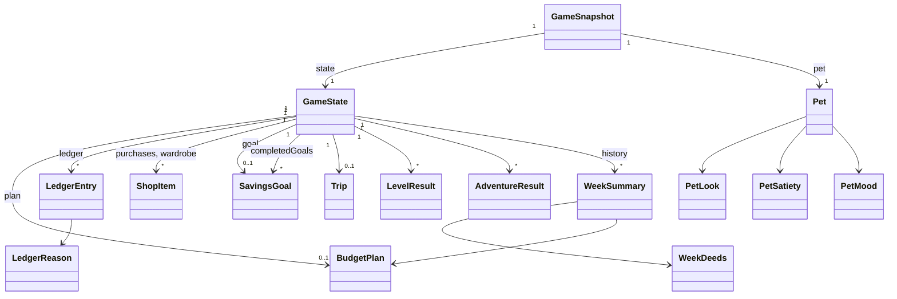

# 02 — Доменная модель

Все сущности ниже — чистый Kotlin без зависимостей от Android. Они лежат в пакете `domain` модуля `:app`
(см. [06](06-architecture.md#модули-и-пакеты)). Игра хранится и меняется целиком — одним снимком `GameSnapshot`.

## Схема


```mermaid
classDiagram
  GameSnapshot "1" --> "1" GameState : state
  GameSnapshot "1" --> "1" Pet : pet
  GameState "1" --> "0..1" BudgetPlan : plan
  GameState "1" --> "*" LedgerEntry : ledger
  GameState "1" --> "*" ShopItem : purchases, wardrobe
  GameState "1" --> "0..1" SavingsGoal : goal
  GameState "1" --> "*" SavingsGoal : completedGoals
  GameState "1" --> "0..1" Trip
  GameState "1" --> "*" LevelResult
  GameState "1" --> "*" AdventureResult
  GameState "1" --> "*" WeekSummary : history
  Pet --> PetLook
  Pet --> PetSatiety
  Pet --> PetMood
  WeekSummary --> WeekDeeds
  WeekSummary --> BudgetPlan
  LedgerEntry --> LedgerReason
```

Справочники контента (только чтение): `ShopItem`, `SavingsGoal`, `Level` (уровни из `Task`), `Adventure` — собраны в `Content`
(см. [05](05-content-model.md)). Купленные товары и цели попадают в игру копией целиком, поэтому старое сохранение
остаётся понятным, даже если в контенте поменяли цену.

## GameSnapshot — корневой агрегат

```kotlin
data class GameSnapshot(val state: GameState, val pet: Pet)
data class Transition<out R>(val game: GameSnapshot, val result: R)
```

Единственный объект, который сохраняется на диск и который меняет игровой движок. Команда — функция
`(GameSnapshot, аргументы) → Transition`: новый снимок и результат для экрана (см.
[06](06-architecture.md#игровой-движок)). Питомец лежит рядом с игрой, а не отдельно, поэтому покупка списывает
монеты и кормит питомца одной записью.

Инварианты (проверяют `GameEngineTest`, `GameRepositoryImplTest`, `PetTest`):

- `balance >= 0` и `savings >= 0`: покупка, пополнение и снятие сверх остатка отклоняются.
- Баланс и копилка меняются только вместе с записью журнала `LedgerEntry` (единственная функция — `post` в
  `GameEngine`).
- Сытость в `0..100`, настроение в `20..100` — ограничиваются при каждом изменении.
- Очки роста только растут, стадия выводится из них и не понижается.
- Отклонённая правилами команда возвращает тот же снимок и ничего не пишет на диск.

## GameState

```kotlin
data class GameState(
    val demoMode: Boolean = false,
    val balance: Int = 0,                               // монеты в кошельке
    val savings: Int = 0,                               // монеты в копилке, общие для любой цели
    val week: Int = 1,                                  // номер недели (игрового периода)
    val phase: PeriodPhase = PeriodPhase.PLANNING,      // PLANNING → ACTIVE
    val plan: BudgetPlan? = null,                       // null, пока план недели не подтверждён
    val periodStartedOn: LocalDate? = null,             // день начала недели (неделя — не чаще раза в день)
    val ledger: List<LedgerEntry> = emptyList(),        // журнал всех движений монет
    val purchases: List<ShopItem> = emptyList(),        // покупки этой недели, обнуляются в конце недели
    val wardrobe: List<ShopItem> = emptyList(),         // купленная одежда, остаётся навсегда
    val goal: SavingsGoal? = null,                      // выбранная цель; null — не выбрана
    val completedGoals: List<SavingsGoal> = emptyList(),
    val trip: Trip? = null,                             // последняя поездка (цель-поездка)
    val depositsThisWeek: List<Int> = emptyList(),
    val depositsByWeek: List<Int> = emptyList(),        // отложено за каждую закрытую неделю (для срока цели)
    val withdrawalsThisWeek: List<Int> = emptyList(),
    val levelResults: List<LevelResult> = emptyList(),  // первые прохождения уровней карты заданий
    val goldLevels: Set<String> = emptySet(),            // уровни с пройденным золотым испытанием
    val adventureResults: List<AdventureResult> = emptyList(),
    val history: List<WeekSummary> = emptyList(),       // итоги закрытых недель
    val tutorial: Boolean = false,                      // идёт обучение на главном экране
    val tutorialSkipped: Set<TutorialStep> = emptySet(),
)
```

Производные значения (считаются, не хранятся):

| Свойство                                                                 | Что это                                                                                                            |
|--------------------------------------------------------------------------|--------------------------------------------------------------------------------------------------------------------|
| `savedThisWeek`                                                          | отложено за неделю за вычетом снятого                                                                              |
| `spentThisWeek(category)`                                                | потрачено на обязательное или необязательное                                                                       |
| `weekIncome`                                                             | карманные (или стартовые) монеты этой недели                                                                       |
| `levelStatus(level, levels)`                                             | `LOCKED` (неделя уровня ещё не началась или не пройден предыдущий), `AVAILABLE`, `DONE`                            |
| `levelResult(level)`, `availableLevels(levels)`, `topicProgress(levels)` | результат уровня, открытые уровни, пройдено по темам                                                               |
| `adventureOfWeek(adventures)`                                            | приключение, которое ждёт на этой неделе                                                                           |
| `finishBlock(today, adventures, levels)`                                 | почему неделю пока нельзя закончить: `PLAN_NOT_CONFIRMED`, `LEVELS_NOT_PLAYED`, `ADVENTURE_NOT_PLAYED`, `SAME_DAY` |
| `goalRemaining()`, `weeksToGoal()`                                       | сколько осталось до цели и примерно за сколько недель ([04](04-rules-and-formulas.md#срок-достижения-цели))        |
| `currentTrip`                                                            | поездка, в которой питомец сейчас                                                                                  |
| `tutorialStep`                                                           | текущий шаг обучения: `PLAN`, `TASKS`, `GOAL`, `SHOP`, `DEEDS`; первые два не пропустить (`required`)              |
| `adventureStatus(adventure, adventures, levels)`                         | приключение недели открыто после уровней недели (`weekLevelsDone`); в демо открыты все                             |
| `GameSnapshot.weekDeeds`                                                 | четыре дела недели: сыт, не скучает, копилка по плану, траты по плану                                              |

## Pet

```kotlin
data class Pet(
    val name: String,                                   // игровое имя питомца
    val look: PetLook,                                  // раскраска: PetColor, 9 вариантов
    val satiety: PetSatiety,                            // сытость 0..100, обратимо
    val mood: PetMood,                                  // настроение 20..100, обратимо
    val growthPoints: Int,                              // очки (шаги) роста, только растут
    val outfit: Map<WearableSlot, String> = emptyMap(), // что надето: место → id вещи
)
```

Производные: `growthStage` (`BABY` 0+, `TEEN` 8+, `ADULT` 16+ очков), `pointsToNextStage`, `isHungry`
(сытость ≤ 30), `mood.level` (`BORED` < 40, `NEUTRAL` 40–69, `HAPPY` ≥ 70). Новый питомец (`Pet.newborn`): сытость 70,
настроение 50, 0 очков. Состояние на экране показано иконкой, числом и подписью, не только цветом (**ТЗ 3.6**).

Профиля в привычном смысле нет: игрок — это питомец. Имя, раскраска и игра хранятся только на устройстве; полей для
реального имени, телефона, e-mail, возраста и фото нет (**ТЗ 2.5.1, 3.5**).

## Журнал: LedgerEntry и LedgerReason

```kotlin
data class LedgerEntry(val week: Int, val reason: LedgerReason, val balanceDelta: Int, val savingsDelta: Int = 0)

sealed interface LedgerReason {
    data object StartCoins                               // стартовые монеты
    data object WeekIncome                               // карманные за неделю
    data object DemoCoins                                // монеты, начисленные себе в демо-режиме
    data class Purchase(val itemName: String)
    data object Deposit                                  // пополнение копилки вручную
    data object PlannedDeposit                           // строка «Копилка» из плана недели
    data object Withdraw                                 // монеты из копилки обратно в кошелёк
    data object SavingsBonus                             // бонус копилки
    data class GoalReached(val goalName: String)         // цель куплена из копилки
    data class TaskReward(val taskTitle: String)        // награда за уровень карты заданий
    data class AdventureReward(val adventureTitle: String)
}
```

Правило **ТЗ 2.5.4**: баланс не меняется без объяснения. У каждой записи есть причина и сумма; как её назвать
словами, решает слой представления (`LedgerReason.text()`, ключи `ledger.*` в `feedback.json`). Журнал недели
показан на экране «Прогресс».

## Неделя: BudgetPlan, WeekDeeds, WeekSummary

```kotlin
enum class PeriodPhase { PLANNING, ACTIVE }

data class BudgetPlan(val mandatory: Int = 0, val optional: Int = 0, val savings: Int = 0) {
    val total: Int get() = mandatory + optional + savings
}

data class WeekDeeds(
    val fed: Boolean,              // куплено еды на недельную сытость
    val notBored: Boolean,         // настроение не ниже «спокойного»
    val savingsOnPlan: Boolean,    // отложено больше нуля и не меньше обещанного
    val spendingOnPlan: Boolean,   // необязательного куплено не больше плана
) { val steps: Int }               // сколько дел сделано — столько шагов роста

data class WeekSummary(
    val week: Int,
    val plan: BudgetPlan,
    val deeds: WeekDeeds,
    val spentMandatory: Int, val spentOptional: Int,
    val saved: Int, val withdrawn: Int, val savingsBonus: Int,
    val moodDelta: Int,
    val stageBefore: PetGrowthStage, val stageAfter: PetGrowthStage,
    val stepsToNextStage: Int?,
    val nextIncome: Int,
)
```

План — не отдельные кошельки, а намерение: покупки идут из общего баланса, а в итогах план сравнивается с фактом
(`WeekSummary.fact(direction)`). `WeekSummary` считается один раз при закрытии недели и хранится в `history`: его
показывают окно итогов недели и экран «Прогресс».

## Цель, поездка

```kotlin
data class SavingsGoal(val id: String, val name: String, val cost: Int, val hint: String, val trip: Boolean = false)
data class Trip(val goalId: String, val week: Int)
```

Сумма накоплений живёт в `GameState.savings`, а не в цели: при смене цели копилка сохраняется. Достигнутая цель
переходит в `completedGoals` и каждую неделю немного радует питомца; цель-поездка (`trip = true`) отправляет его
в поездку на эту неделю.

## Задания и приключения

```kotlin
data class LevelResult(val levelId: String, val week: Int, val stars: Int, val reward: Int)
data class AdventureResult(val adventureId: String, val week: Int, val perfect: Boolean, val reward: Int)
enum class LevelStatus { LOCKED, AVAILABLE, DONE }
```

Сами уровни, задания и приключения — контент ([05](05-content-model.md)). Уровень — 6 заданий одной темы, за прохождение — 4 случайных (`GameRules.TASKS_PER_LEVEL`);
уровни идут друг за другом: следующий открывается, когда пройден предыдущий, и не раньше своей
игровой недели; непройденный не сгорает. `LevelResult` — первое прохождение:
звёзды 1–3 по числу ошибок и награда. Повторно уровень проходится только как золотое испытание: без монет, результат —
id уровня в `goldLevels`. В демо все уровни открыты сразу (**ТЗ 2.5.8**).

## Настройки

```kotlin
data class AppSettings(
    val soundEnabled: Boolean = true,
    val animationsEnabled: Boolean = true,
    val tipsEnabled: Boolean = true,
    val voiceRepeatEnabled: Boolean = false,   // «Кот повторяет слова», нужен микрофон
)
```

Хранятся отдельно от игры (`settings.json`), поэтому сброс игры их не трогает, а «Удалить все данные» возвращает к
значениям по умолчанию.

## Исходы команд и ошибки

Исход по правилам — не исключение, а значение в результате команды:

```kotlin
sealed interface PurchaseResult { Success(item, balanceAfter); NotEnough(missing); AlreadyOwned }
sealed interface DepositResult { Success; Rejected(balance) }
sealed interface WithdrawResult { Success; Rejected(savings) }
sealed interface ConfirmPlanResult { Success; Rejected(budget) }
sealed interface FinishWeekResult { Finished(summary); Blocked(reason: FinishBlock) }
```

Сбой сохранения — отдельно: `Result.Error(StorageError)` с причинами `READ_FAILED`, `WRITE_FAILED`, `NO_SPACE`,
`NO_ACCESS`, `CORRUPTED`, `INCOMPATIBLE_VERSION` (`domain/storage/StorageError.kt`). Тексты для ребёнка — в
`feedback.json` (ключи `storage.*`, [05](05-content-model.md#тексты-обратной-связи--assetscontentfeedbackjson)).

## Формат сохранения

Снимок пишется в `files/datastore/game.json` через DTO (`data/game/store/GameSaveDto.kt`): `GameSaveFile(version,
game: GameSnapshotDto?, beforeDemo: GameSnapshotDto?)`, где `GameSnapshotDto` повторяет `GameState` и `Pet` полями,
а `beforeDemo` — игра ребёнка, отложенная на время демо-режима (null — демо не включено). Текущая версия формата —
`GAME_SAVE_VERSION = 3` (3 — задания стали уровнями карты); сохранение другой версии сбрасывается с сообщением. Настройки — в `settings.json`
(`SettingsSaveFile`).
