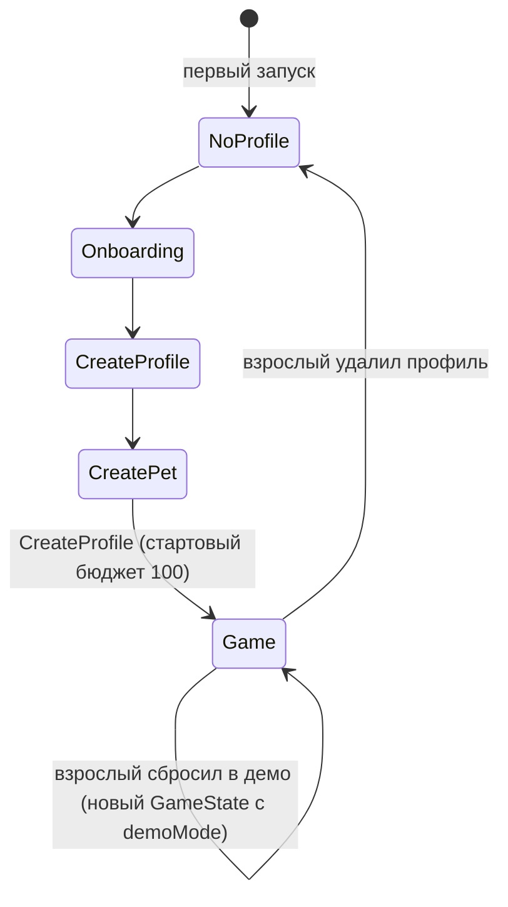
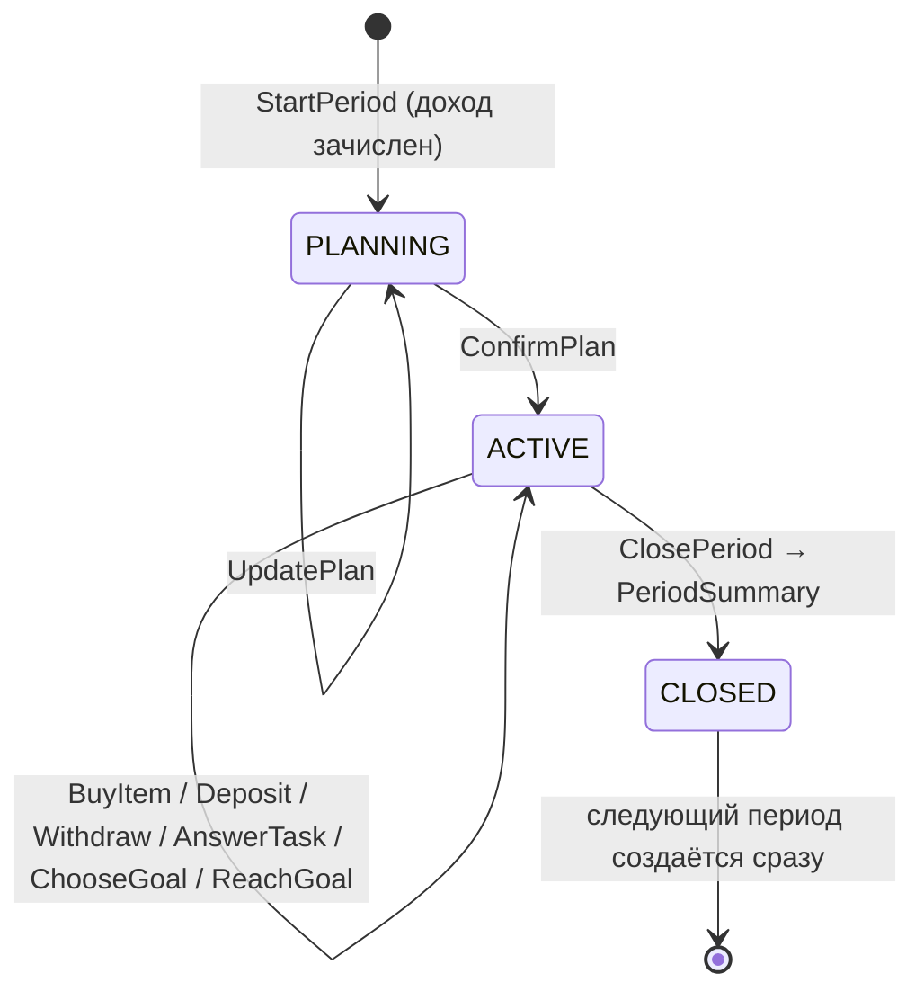

# 03 — Бизнес-процессы

Каждый процесс описан как: когда запускается → шаги → проверки → что меняется → что показываем.
Числа берутся из [04-rules-and-formulas.md](04-rules-and-formulas.md); здесь они приводятся
для наглядности со значениями по умолчанию.

## Жизненный цикл приложения



При старте приложение читает `GameState` с диска. Если его нет — онбординг. Если есть — сразу
главный экран (**ТЗ 2.5.13**, шаг 11 сценария). Никаких сетевых вызовов при запуске.

## Жизненный цикл игрового периода



Что разрешено в какой фазе:

| Команда | PLANNING | ACTIVE |
|---|---|---|
| UpdatePlan | да | нет (`PlanAlreadyConfirmed`) |
| ConfirmPlan | да | нет |
| BuyItem, Deposit, Withdraw | нет (`PlanNotConfirmed`) | да |
| AnswerTask | да | да |
| ChooseGoal, ReachGoal | да | да |
| ClosePeriod | нет | да |
| ClaimDailyBonus, AdultBonus | да | да |

Задания разрешены в PLANNING специально: ребёнок может заработать до составления плана.
Заработанное в ACTIVE увеличивает баланс сверх плана — это нормально и показывается в итогах
как «дополнительный доход».

Период не привязан к календарю ни в одном режиме. Единственная календарная механика —
ежедневный бонус, и она отключена в демо-режиме.

---

## П1. Первый запуск и создание профиля

**Триггер:** нет сохранённого `GameState`.

1. Онбординг, 3 карточки: «Это Финни, ему нужна твоя помощь», «Три решения: обязательное / желаемое / отложить»,
   «Заботься — и Финни вырастет». Кнопка «Пропустить» на каждой. **ТЗ 2.5.1**
2. Экран «Придумай игровое имя»: поле 1..16 символов, подсказка «Не пиши настоящее имя».
   Кнопка «Случайное имя» генерирует из списка в `content/names.json`.
3. Экран питомца: выбор вида (3), окраса (3), превью, поле имени питомца с кнопкой «Случайное».
4. Команда `CreateProfile`. Движок создаёт:
   - `Profile`, `Pet` (state 70/70/70, stage BABY, growthPoints 0),
   - `Wallet(balance = 100, savings = 0)` + транзакция `START_BALANCE` «Стартовые монеты +100»,
   - `Period(index = 1, phase = PLANNING, mandatoryNeeds = ["food", "care"])`.
5. Экран `Home` с всплывающей подсказкой «Сначала составь план на неделю».

**Ошибки:** пустое имя, имя длиннее 16 — валидация на UI, движок дублирует проверку.

**Подсказка всегда доступна:** кнопка «?» на главном экране открывает те же 3 карточки + глоссарий (**ТЗ 2.5.1**).

---

## П2. Начало периода и доход

**Триггер:** создание профиля (период 1) или закрытие предыдущего периода.

1. Создаётся `Period(index = n, phase = PLANNING)`.
2. Для `n ≥ 2` зачисляется периодический доход: транзакция `PERIOD_INCOME` «Карманные деньги +60».
   Для периода 1 доходом служит стартовый бюджет.
3. `mandatoryNeeds` берётся из конфига (`["food", "care"]`); если на этот период есть событие
   (`content/events.json`, опционально), его теги добавляются.
4. `budgetAtPlanning = wallet.balance`.
5. Показываем баннер «Новая неделя! У тебя N монет. Составь план».

Ежедневный бонус (опционально, `config.dailyBonus.enabled`): при открытии приложения в новую
календарную дату — транзакция `DAILY_BONUS` +5 с объяснением «За то, что зашёл сегодня».
В демо-режиме не начисляется, чтобы демонстрация была детерминированной.

---

## П3. Планирование бюджета (ТЗ 2.5.5)

**Экран:** `BudgetPlan`. **Фаза:** PLANNING.

1. Показываем доступную сумму `budgetAtPlanning` и три ползунка/степпера: обязательное, желаемое, накопления.
   Шаг 5 монет. Рядом с обязательным — подсказка «Еда и уход на неделю стоят примерно 25».
2. Внизу постоянно виден остаток: `available − total`. Если остаток < 0 — кнопка «Подтвердить» неактивна
   и показан текст «Не хватает N монет. Уменьши что-нибудь». **Никакого красного цвета в одиночку** — иконка + текст.
3. `UpdatePlan` можно вызывать сколько угодно.
4. `ConfirmPlan`: проверки `total ≤ available`, `total > 0`. Если план без накоплений (`savings = 0`) —
   мягкое предупреждение «Ты ничего не откладываешь. Точно?» с двумя кнопками, но это разрешено.
5. После подтверждения `phase = ACTIVE`, план заморожен. Экран переключается в режим «План и факт»:
   три строки с прогресс-барами «потрачено из запланированного».

Остаток нераспределённых монет остаётся на балансе и доступен для трат. В итогах он не считается ошибкой.

---

## П4. Выполнение задания (ТЗ 2.5.8)

**Экран:** `Tasks` → `TaskPlay` → `TaskResult`.

1. Список заданий группируется по 3 темам: «Планирую» (BUDGET), «Коплю» (SAVINGS), «Покупаю» (PAYMENTS).
   У каждого — статус (см. [02](02-domain-model.md#task-и-taskresult)) и награда.
2. Лимит: не более `config.tasksPerPeriod = 2` заданий за период. В демо-режиме лимита нет.
   Кнопка задания при лимите неактивна с текстом «На этой неделе хватит. Продолжим в следующей».
3. Задание — не тест. Три типа (см. [05](05-content-model.md#задания--tasksjson)):
   - `CHOICE` — ситуация и 2–4 варианта действий, у каждого своё последствие;
   - `ALLOCATE` — раздели сумму по трём кучкам;
   - `SHOP_LIST` — собери покупки в пределах бюджета.
4. `AnswerTask(taskId, answer)`: движок вызывает оценщик типа задания → `success`.
5. Награда: `success ? task.reward : task.rewardOnMistake`. Транзакция `TASK_REWARD`
   «Задание: Список покупок +20». При ошибке награда меньше, но не ноль — ребёнок всё равно
   что-то узнал.
6. Экран результата: что выбрал, что произошло (1–2 фразы), почему (1 фраза), сколько монет получил,
   кнопка «Понятно» → назад к списку. Объяснение показывается **всегда**, и при успехе, и при ошибке.
7. Ошибочное задание становится доступным снова в следующем периоде (путь восстановления).
   Успешное больше не повторяется.

Настроение питомца от заданий не меняется напрямую: задания дают монеты, а монеты — уже через
покупки и накопления влияют на питомца. Так связь «решение → последствие» остаётся прозрачной.

---

## П5. Покупка (ТЗ 2.5.6)

**Экран:** `Shop` → `PurchaseConfirm` → обратная связь. **Фаза:** ACTIVE.

1. Каталог в двух вкладках: «Нужное» (MANDATORY) и «Желаемое» (OPTIONAL). У каждого товара:
   картинка, название, цена, категория текстом, эффект («Сытость +40»).
   Над «Нужным» — чек-лист периода: «Еда ☐ Уход ☐» из `mandatoryNeeds`/`coveredNeeds`.
2. Нажатие → экран подтверждения: цена, категория, эффект, «Останется N монет».
   Если покупка выводит категорию за план: предупреждение «Ты планировал на желаемое 20, а потратишь 35.
   Это твой выбор» — покупка **разрешена**.
3. `BuyItem(itemId)` проверки:
   - фаза ACTIVE, иначе `PlanNotConfirmed`;
   - `price ≤ balance`, иначе `InsufficientFunds(missing, options)`.
4. При успехе: транзакция `PURCHASE` −price; `facts.{mandatory|optional}Spent += price`;
   `purchasedItemIds += id`; `coveredNeeds += item.tags ∩ mandatoryNeeds`;
   `pet.state += item.effects` (с ограничением 0..100).
5. Обратная связь: карточка «Изменилось: монеты −15, сытость +40. Финни поел и рад!»
   Для желаемого: «Монеты −20, настроение +15. Мячик понравился!».

**Нехватка средств** (шаг 7 сценария, обязательно к демонстрации):
экран «Не хватает 12 монет» и список вариантов из `RecoveryOption`:
- «Выполни задание „…“ (+20)» — если есть доступное задание с наградой ≥ missing;
- «Взять из копилки 12» — если `savings ≥ missing` (ведёт в П7 с предзаполненной суммой);
- «Выбрать дешевле: „Корм“ 15» — товар той же категории, который по карману;
- «Подождать следующую неделю» — всегда.
Отрицательный баланс невозможен ни при каком пути.

---

## П6. Выбор цели и пополнение накоплений (ТЗ 2.5.7)

**Экран:** `Savings`.

1. Если цели нет — список из 3 целей с ценой и картинкой. `ChooseGoal(goalId)` — фиксирует цель.
   Смена цели позже возможна с подтверждением «Копилка останется, цель поменяется».
2. Карточка цели: цена, накоплено, осталось, прогресс-бар, «≈ N недель при таком же пополнении»
   (формула в [04](04-rules-and-formulas.md#срок-достижения-цели)). Если срок посчитать нельзя —
   текст «Начни откладывать, и я посчитаю, когда ты накопишь».
3. `Deposit(amount)`: степпер по 5, максимум `balance`. Проверки: ACTIVE, `0 < amount ≤ balance`.
   Транзакция `SAVINGS_DEPOSIT` (balance −a, savings +a), `facts.saved += a`.
   Обратная связь: «Отложил 10. До цели осталось 70. Финни гордится тобой».
4. Когда `savings ≥ goal.cost` — кнопка «Получить!» → `ReachGoal`: транзакция `GOAL_REACHED`
   (savings −cost), цель в `completedGoals`, `pet.state.mood += 30`, открывается аксессуар цели,
   экран праздника. Цель обнуляется, предлагаем выбрать новую.

---

## П7. Снятие из накоплений (ТЗ 2.5.7)

**Экран:** `Savings` → `WithdrawConfirm`. **Фаза:** ACTIVE.

1. Кнопка «Взять из копилки» видна только если `savings > 0`.
2. Ввод суммы, максимум `savings`.
3. **До подтверждения** показываем: «Было 60 → станет 48. Срок до цели: было ≈ 2 недели → станет ≈ 3».
4. Отдельная кнопка подтверждения «Да, взять». `Withdraw(amount)` → транзакция `SAVINGS_WITHDRAW`
   (balance +a, savings −a), `facts.saved −= a` (может уйти в минус в рамках периода).
5. Обратная связь без осуждения: «Ты взял 12 из копилки. Это нормально, если очень нужно.
   В следующий раз попробуй отложить чуть больше».

---

## П8. Закрытие периода и итоги (ТЗ 2.5.9, 2.5.10)

**Триггер:** кнопка «Завершить неделю» на Home. **Фаза:** ACTIVE.

1. Диалог подтверждения: «Закончить неделю? Ты купил еду ☑, уход ☐, отложил 10».
   Если не закрыты обязательные потребности — предупреждение «Финни останется без ухода.
   Можно ещё купить» с кнопками «Вернуться» / «Всё равно закончить». Это выбор ребёнка, не блок.
2. `ClosePeriod`. Движок считает `PeriodSummary` по правилам из [04](04-rules-and-formulas.md#итоги-периода):
   - A `mandatoryCovered`: все `mandatoryNeeds` в `coveredNeeds`;
   - B `planKept`: `optionalSpent ≤ plan.optional`;
   - C `savedSomething`: `saved > 0 && saved ≥ plan.savings`;
   - `score = A + B + C`.
3. Применяем к питомцу: естественное снижение (сытость −35, уход −25, настроение −10),
   затем `moodDelta` по score, затем `growthPoints += score`, пересчёт стадии.
4. Генерируем `explanation` — до трёх фраз по шаблонам из `feedback.json`, например:
   «Ты купил всё нужное — Финни сыт», «Потратил на желаемое больше плана — в следующий раз
   сверься с планом», «Отложил 10 — до цели ближе».
5. `history += summary`, создаётся новый период (П2).
6. Экран `PeriodSummary`: три строки план/факт, три критерия с иконками ✓/○ и текстом,
   изменение настроения, если стадия выросла — анимация и «Финни подрос!».
   Кнопка «Дальше» → новый план.

Стадия никогда не понижается. Настроение при плохом периоде снижается, но не ниже 0, и на
следующей неделе легко поднимается едой и уходом — это и есть «безопасная ошибка».

---

## П9. Обратная связь после каждого действия (ТЗ 2.5.9)

Единый механизм: каждая успешная команда возвращает `List<FeedbackLine>`:

```kotlin
data class FeedbackLine(
    val kind: FeedbackKind,          // BALANCE, SAVINGS, PET_STAT, EXPLANATION, NEXT_STEP
    val text: String,                // «Монеты −15»
    val delta: Int? = null,
)
```

UI показывает их одной карточкой снизу («bottom sheet») на 3–5 секунд или до нажатия.
Порядок всегда: что изменилось → почему → что дальше. Шаблоны — в `feedback.json`.

---

## П10. Прогресс и история (ТЗ 2.5.11)

**Экран:** `Progress`. Только чтение:

- стадия питомца и очки роста до следующей стадии;
- цель: накоплено / цена;
- выполненные задания по темам (галочка, награда);
- итоги последнего периода (краткая версия `PeriodSummary`);
- журнал операций текущего периода (из `ledger`), чтобы ребёнок видел, откуда монеты.

Плюс `Help`: 3 карточки онбординга и глоссарий из `content/glossary.json`.

---

## П11. Раздел для взрослого (ТЗ 2.5.12)

**Экран:** `AdultGate` → `Adult`.

1. Барьер: пример вида «17 + 26 = ?» (случайные двузначные, сумма ≤ 99), поле ввода, 3 попытки.
   Неверно → новый пример. Барьер сложен для 7-летнего и тривиален для взрослого — этого достаточно.
2. Внутри:
   - цели приложения (6 компетенций простым языком);
   - пройденные темы: по каждой из 3 тем сколько заданий выполнено;
   - общий прогресс: периодов пройдено, стадия питомца, целей достигнуто. **Без** слов «ошибки», «плохо», «не справился»;
   - «Начислить бонус» (опционально): сумма 5..50 и причина из списка («Помог по дому» и т.п.) → `AdultBonus`;
   - настройки: звук, анимации;
   - «Включить демо-режим» → `ResetToDemo` с подтверждением;
   - «Сбросить профиль» → подтверждение → удаление `GameState` → онбординг;
   - «Удалить все данные» → подтверждение → то же + очистка настроек. Для MVP сброс и удаление
     технически одинаковы, но обе кнопки должны быть (**ТЗ 3.5**).

---

## П12. Демонстрационный режим (ТЗ 2.5.13)

Цель: эксперт проходит все 12 шагов сценария подряд, за 5–7 минут, без ожидания.

- Включается из раздела взрослого или флагом сборки `BuildConfig.DEMO_DEFAULT` для демо-APK.
- `ResetToDemo` создаёт `GameState` из `content/demo-profile.json`: имя «Демо», питомец «Финни»
  (кот, рыжий), период 1 в фазе PLANNING, баланс 100, `settings.demoMode = true`.
- В демо-режиме: ежедневный бонус выключен, лимит заданий на период снят, на Home видна плашка «Демо».
- Сброс к исходному состоянию — та же команда `ResetToDemo`, доступна в разделе взрослого.
- Демо-режим не меняет ни одной формулы экономики: то, что видит эксперт, и то, что видит ребёнок, считается одинаково.

Сценарий эксперта с ожидаемыми значениями расписан в [09-test-cases.md](09-test-cases.md#e2e-обязательный-сценарий).
