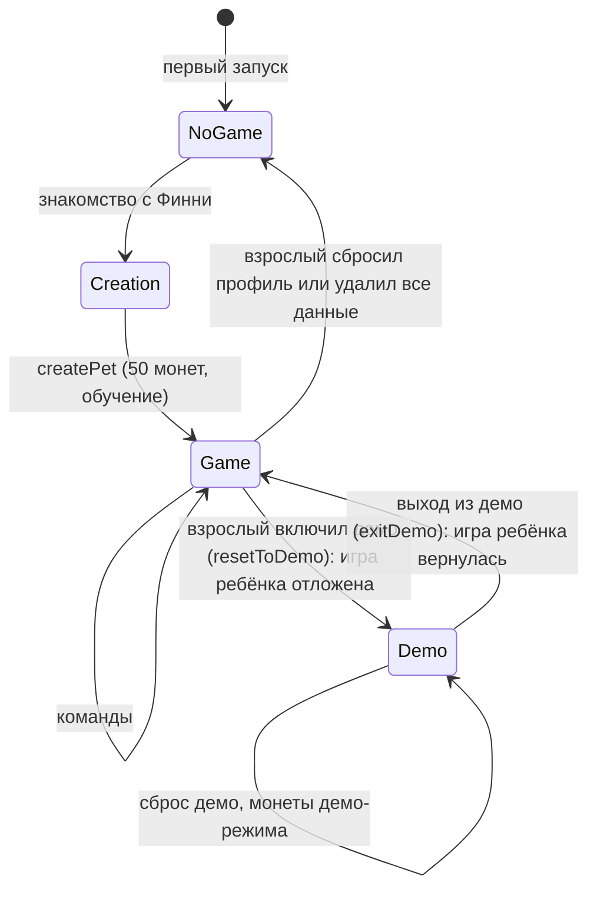
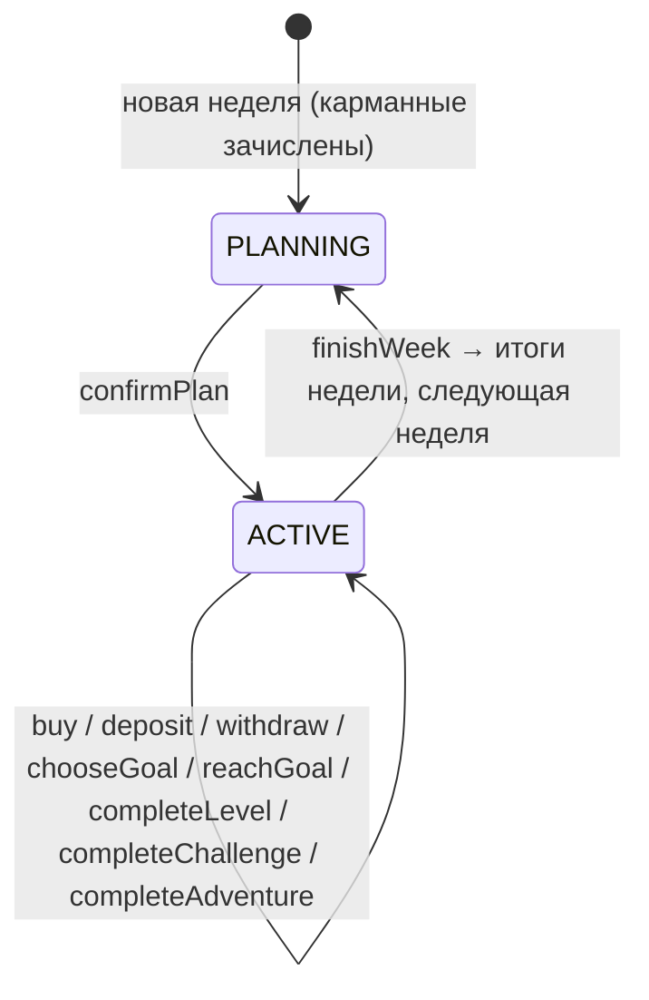

# 03 — Бизнес-процессы

Каждый процесс описан как: когда запускается → шаги → проверки → что меняется → что показываем.
Числа берутся из [04-rules-and-formulas.md](04-rules-and-formulas.md); здесь они приводятся для наглядности.
Команды — функции `GameEngine` и `GameRepository` ([06](06-architecture.md#игровой-движок)).

## Жизненный цикл приложения

```mermaid
stateDiagram-v2
  [*] --> NoGame : первый запуск
  NoGame --> Creation : знакомство с Финни
  Creation --> Game : createPet (50 монет, обучение)
  Game --> Game : команды
  Game --> NoGame : взрослый сбросил профиль или удалил все данные
  Game --> Demo : взрослый включил демо (resetToDemo): игра ребёнка отложена
  Demo --> Demo : сброс демо, монеты демо-режима
  Demo --> Game : выход из демо (exitDemo): игра ребёнка вернулась
```

При старте `PetCreationViewModel` читает игру с диска (`GameRepository.load`). Есть — сразу главный экран
(**ТЗ 2.5.13**, шаг 11 сценария). Нет — знакомство с Финни. Повреждённое сохранение или сохранение чужой версии —
знакомство с пояснением. Ошибка чтения — экран с кнопкой «Повторить», новую игру поверх не начинаем. Сетевых вызовов
нет.

## Жизненный цикл недели (игрового периода)

```mermaid
stateDiagram-v2
  [*] --> PLANNING : новая неделя (карманные зачислены)
  PLANNING --> ACTIVE : confirmPlan
  ACTIVE --> ACTIVE : buy / deposit / withdraw / chooseGoal / reachGoal / completeLevel / completeChallenge / completeAdventure
  ACTIVE --> PLANNING : finishWeek → итоги недели, следующая неделя
```

Что разрешено в какой фазе:

| Команда | PLANNING | ACTIVE |
|---|---|---|
| `confirmPlan` | да | нет (план уже подтверждён) |
| `buy` | нет (`PurchaseResult.NoPlan`: сначала план) | да |
| `deposit`, `withdraw` | да | да |
| `completeLevel`, `completeChallenge`, `completeAdventure` | да | да |
| `chooseGoal`, `reachGoal` | да | да |
| `finishWeek` | нет (`PLAN_NOT_CONFIRMED`) | да, если пройдены уровни и приключение недели и неделя началась не сегодня |

Тратить можно только после плана: сначала монеты недели раскладывают, потом тратят. Магазин без плана показывает
«Сначала разложи монеты недели по плану» и кнопку к плану. Копилка и задания плана не требуют; закончить неделю без
плана нельзя, а на главном экране Финни первым делом просит его составить.

Голодный Финни неделю не держит: еда — дело недели (шаг роста), а не условие её конца. Если ребёнок спустил монеты на
необязательное, неделю всё равно можно закончить — новая неделя приносит карманные, и на них покупается еда
(`GameRepositoryImplTest.hungryAndBrokeChildCanStillFinishWeek`).

Неделя в обычной игре — не чаще раза в день (`FinishBlock.SAME_DAY`): так карманные не набираются нажатиями. В
демо-режиме это ограничение снято.

---

## П1. Первый запуск и знакомство (ТЗ 2.5.1, 2.5.2)

**Триггер:** нет сохранённой игры. **Экран:** `PetCreationScreen`.

1. Знакомство по шагам, Финни говорит с ребёнком:
   - «Привет» — кто такой Финни;
   - «Раскраска» — 9 раскрасок, кот сразу перекрашивается;
   - «Имя» — поле до 16 символов, по умолчанию «Финни»; пустое имя дальше не пускает;
   - три урока: «Карманные монеты» (три кучки плана недели), «Дела недели» (четыре дела — шаги роста), «Цель»
     (копим на кроватку, велосипед, море). Уроки можно пропустить.
2. `createPet`: новая игра со стартовыми монетами 50 (запись журнала «Стартовые монеты»), неделя 1 в фазе плана,
   питомец-малыш: сытость 70, настроение 50, 0 шагов роста. Включается обучение на главном экране.
3. Главный экран. Обучение ведёт по настоящим действиям: составить план → пройти первый уровень заданий →
   выбрать цель → купить еду → посмотреть дела недели. План пропустить нельзя, остальные шаги — можно.

**Ошибка записи** при создании питомца показывается на форме, введённое не теряется.

**Подсказка всегда доступна (ТЗ 2.5.1):** «Настройки» → «Как играть» (карточки знакомства) и «Словарик»; нажатие на
показатель главного экрана объясняет, от чего он зависит.

---

## П2. Начало недели и доход (ТЗ 2.5.4)

**Триггер:** создание питомца (неделя 1) или закрытие прошлой недели.

1. Неделя 1: доходом служат стартовые 50 монет.
2. Неделя 2 и дальше: при закрытии прошлой недели зачисляются карманные по стадии питомца — 50 / 60 / 70 (запись
   «Карманные деньги»). Не потраченное на прошлой неделе остаётся в кошельке.
3. Фаза — план. Окно плана начинается с прошлого плана.

Каждое начисление — запись журнала с причиной и суммой; журнал недели — на экране «Прогресс».

---

## П3. План недели (ТЗ 2.5.5)

**Экран:** окно «План недели» (`WeekPlanDialog`), открывается кнопкой на главном экране.

1. Видны монеты недели и три строки: обязательное, необязательное, копилка. Кнопки «+», «−» (шаг 5) и ползунок.
2. Подсказка у обязательного: «Финни на еду нужно хотя бы 20» — цена еды на недельную сытость
   (`cheapestFoodFor(35)`). Если на обязательное меньше — предупреждение «…Финни может остаться голодным. Решать
   тебе»: это выбор ребёнка, не запрет.
3. Внизу — «Осталось разложить: N». Кнопка «Начать неделю» активна, только когда разложено всё (остаток 0).
   Больше бюджета разложить нельзя: «+» останавливается на остатке.
4. `confirmPlan`: план должен разложить весь баланс, без минусов, один раз за неделю. Фаза → ACTIVE. Строка
   «Копилка» сразу уходит в копилку (запись «В копилку по плану»).
5. Дальше план сравнивается с фактом: в магазине — сколько осталось по строке, в итогах недели и на «Прогрессе» —
   план и факт по каждой строке.

---

## П4. Задания (ТЗ 2.5.8)

**Экраны:** `Tasks` (карта) → `LevelPlay` (упражнения и итог).

1. Карта-тропинка по неделям: каждую игровую неделю открываются три уровня — по одному на тему (планирую, коплю,
   покупаю) — и приключение недели. Уровни следующей недели видны с замком и подписью, когда откроются: «завтра»,
   если эта неделя уже прожита сегодня, иначе — «на новой неделе». Уровни проходятся строго по очереди: следующий
   открывается после предыдущего («Откроется, когда пройдёшь «…»»), пропустить нельзя; непройденный не сгорает.
   Приключение недели стоит в конце тропинки недели и открывается, когда пройдены её уровни. В демо все уровни и
   приключения открыты сразу (**ТЗ 2.5.8**).
   В шапке — звёзды недели, которая сейчас на экране: «Неделя 2 · ★ 7/9»; текущий уровень подсвечен кольцом.
2. Нажатый узел раскрывает карточку: тема, число заданий и награда — и «Начать»; у пройденного — звёзды и
   «Золотое испытание»; у закрытого — когда откроется.
3. Уровень — 4 коротких задания подряд, выбранных случайно из 6 заданий уровня (повтор не выучить наизусть);
   сложность растёт от недели к неделе. Выход из начатого уровня переспрашивает: «Прогресс уровня сбросится».
   Три механики
   ([05](05-content-model.md#задания--taskcontentkt)):
   - «Выбор» — ситуация и 2–3 варианта действий, у каждого своё последствие;
   - «Раздели сумму» — разложи монеты по кучкам;
   - «Собери покупки» — выбери товары в пределах бюджета.
4. После каждого ответа — разбор: верно или «почти получилось», что случилось из-за выбора и почему. Объяснение
   показывается **всегда**; ошибка не останавливает уровень.
5. Итог уровня (`completeLevel`): звёзды 3 / 2 / 1 (без ошибок / одна / больше), «верных N из M» и награда 3 без
   ошибок или 2 с ошибками (запись «Задание: …»). Награда — только за первое прохождение.
6. Золотое испытание пройденного уровня (`completeChallenge`): без подсказок, 30 секунд на задание (таймер стоит,
   пока ребёнок читает разбор, и пока приложение свёрнуто). Без ошибок и в срок — уровень становится золотым.
   Монет нет: звание не превращается в заработок.

Уровни не меняют питомца напрямую: они дают монеты, а монеты через покупки и копилку влияют на Финни.

---

## П5. Приключение недели (ТЗ 2.5.8)

**Экран:** `AdventurePlay`.

1. Одно приключение за неделю, по порядку; непройденное не сгорает. Пока оно не пройдено, неделю закончить нельзя.
2. Шаги сюжета: история, оплата купюрами и монетами, сдача, выбор, корзина покупок. После ошибки — объяснение и
   можно исправить; сюжет продолжает решение ребёнка.
3. `completeAdventure`: награда 5 без ошибок, 3 с ошибками (запись «Приключение: …»). Повторное прохождение награды не даёт.

---

## П6. Покупка (ТЗ 2.5.6)

**Экраны:** `Shop` → окно покупки → окно «Куплено» или «Не хватает монет».

1. Две вкладки: «Обязательное» (еда) и «Необязательное» (радости и одежда). У товара: картинка, название, цена,
   эффект, короткая подсказка; над списком — сколько осталось по строке плана.
2. Нажатие → окно покупки: категория и цена, «Финни получит» (сытость, настроение), сколько останется монет и по
   плану. Если покупка выходит за план — строка «Сверх плана»: покупка **разрешена**, это выбор ребёнка.
3. `buy`: цена ≤ баланса; одежда покупается один раз.
4. Успех: списание (запись журнала с названием товара), сытость и настроение питомца меняются сразу, одежда попадает в гардероб.
   Окно «Куплено» показывает, что изменилось; для одежды — переход в гардероб.

**Нехватка средств** (шаг 7 сценария, обязательно к демонстрации): окно «Не хватает N монет» и «Что можно
сделать»:
- «Взять N из копилки и купить» — если в копилке хватает на недостающее; до нажатия видно, сколько останется в
  копилке, сколько не хватит до цели и как изменится срок (**ТЗ 2.5.7**);
- «Заработать на задании»;
- «Выбрать дешевле: …» — товар, который по карману;
- «Подождать следующую неделю» — придут новые карманные.

Отрицательный баланс невозможен ни при каком пути.

---

## П7. Цель и пополнение копилки (ТЗ 2.5.7)

**Экран:** `Savings`.

1. Цели плитками: кроватка 60, велосипед 90, поездка на море 110, ремонт в комнате 120. `chooseGoal` фиксирует
   цель; смена цели — с подтверждением «Новая цель?»: монеты в копилке остаются, меняется только цель.
2. Кольцо цели: накоплено из стоимости, «Осталось N · примерно M нед.» (формула в
   [04](04-rules-and-formulas.md#срок-достижения-цели)). Если срок посчитать нельзя — «Отложи — и я посчитаю срок».
3. `deposit`: сумма кнопками «+» и «−» с шагом 5, до всего кошелька; если в кошельке меньше 5 — всё, что есть. При
   пустом кошельке кнопка «Отложить» выключена. Запись «В копилку».
4. Когда накоплено достаточно — кнопка «Достичь цели!» → `reachGoal`: копилка уменьшается на стоимость, цель
   переходит в достигнутые, настроение +10, праздник «Цель достигнута!». Кроватка и велосипед появляются в комнате,
   ремонт меняет комнату, поездка на море отправляет Финни на пляж на эту неделю.

---

## П8. Снятие из копилки (ТЗ 2.5.7)

**Экран:** `Savings` → окно снятия (`WithdrawDialog`).

1. Кнопка «Забрать из копилки» — если в копилке что-то есть.
2. Сумма — кнопками с шагом 5, до всей копилки.
3. **До подтверждения** окно показывает, сколько останется в копилке и насколько отодвинется цель (срок было →
   станет).
4. Отдельная кнопка подтверждения → `withdraw`: запись «Из копилки».
5. Без осуждения: снятое вычитается из отложенного за неделю, поэтому дело «Копилка по плану» может не получиться —
   об этом скажут итоги недели. Пополнить копилку снова можно в ту же неделю.

---

## П9. Конец недели и итоги (ТЗ 2.5.9, 2.5.10)

**Триггер:** «Дела недели» (солнышко на главном экране) → «Завершить неделю».

1. Окно дел недели: что уже сделано и что осталось сделать. Если неделю закончить нельзя — объяснение вместо
   кнопки: «Сначала разложи монеты на неделю», «На этой неделе тебя ждёт приключение…», «Эта неделя уже прожита.
   Приходи завтра…».
2. `finishWeek`:
   - засчитываются четыре дела (сыт, не скучает, копилка по плану, траты по плану) — каждое даёт шаг роста;
   - бонус копилки +5, если за неделю отложено не меньше 10;
   - сытость −35, настроение −15 + до +9 от вещей и достигнутых целей;
   - новая стадия при 8 и 16 шагах;
   - неделя +1, фаза плана, карманные по новой стадии.
3. Окно итогов недели: четыре дела с отметками, план и факт по строкам, бонус копилки, изменение настроения и его
   причина (за неделю −15, одежда и достигнутые цели — плюс),
   «Финни подрос!», сколько шагов до следующей стадии, сколько монет пришло на новую неделю.
4. Дальше — план новой недели.

Стадия никогда не понижается. Настроение не опускается ниже «скучает» и легко поднимается радостями — это и есть
«безопасная ошибка».

---

## П10. Обратная связь после действия (ТЗ 2.5.9)

Домен отдаёт факты (результат команды, `LedgerReason`, `WeekSummary`), слова берутся из `feedback.json` по
`FeedbackKey`. Порядок всегда: что изменилось → почему → что дальше.

- Покупка — окно «Куплено» с эффектом, задание — итог с объяснением и наградой, приключение — объяснение после каждого
  шага, неделя — итоги.
- Главный экран: монеты, копилка, цель, сытость и настроение, активное задание; реплики Финни над головой
  подсказывают следующий шаг («Мур! Я проголодался» — только при сытости ≤ 30; «Мы всё успели» — только когда
  сделаны все четыре дела, иначе «Неделю уже можно завершить. Посмотрим, какие дела ещё успеем?»).

---

## П11. Прогресс и справка (ТЗ 2.5.11)

**Экран:** `Progress` (кнопка на главном экране). Только чтение:

- стадия питомца и шаги до следующей;
- цель: накоплено из стоимости;
- итоги прошлой недели: дела, план и факт;
- задания по темам: сколько выполнено;
- достигнутые цели;
- «Монеты этой недели» — журнал, откуда пришли и куда ушли монеты.

Словарик — «Настройки» → «Словарик».

---

## П12. Раздел для взрослого (ТЗ 2.5.12)

**Экран:** «Настройки» → «Для взрослых» (`AdultScreen`).

1. Барьер: пример «a + b = ?», a и b от 10 до 49, поле ввода, 3 попытки, потом новый пример. Сложно для 7-летнего и
   тривиально для взрослого.
2. Внутри:
   - «Чему учится ребёнок» — 6 компетенций простым языком;
   - «Общий прогресс»: питомец и стадия, недель завершено, целей достигнуто, монеты и копилка, текущая цель.
     **Без** слов «ошибки», «плохо», «не справился»;
   - «Пройденные темы»: по каждой из трёх тем сколько заданий выполнено;
   - настройки: звук, анимации;
   - «Демонстрационный режим»: «Включить демо»; в демо — «Добавить 50 монет», «Сбросить демо», «Выйти из демо»
     (включение, сброс и выход — с подтверждением);
   - «Сбросить профиль» — удаляет игру, настройки сохраняются, открывается знакомство;
   - «Удалить все данные» — то же и настройки возвращаются к исходным (**ТЗ 3.5**).

Все действия, меняющие прогресс, — только после окна подтверждения (**ТЗ 3.6**).

---

## П13. Демонстрационный режим (ТЗ 2.5.13)

Цель: эксперт проходит все 12 шагов сценария подряд, без ожидания.

- Включается из раздела взрослого (`resetToDemo`): питомец «Финни Демо» коралловой раскраски, 50 монет, неделя 1 в
  фазе плана, `demoMode = true`. На главном экране — плашка «Демо».
- **Игра ребёнка не пропадает.** При включении демо она откладывается (`GameRepository.gameBeforeDemo`) и пишется в
  тот же файл одной записью с демо-игрой, поэтому переживает перезапуск и сбой диска. Повторный сброс демо
  откладывает по-прежнему игру ребёнка.
- В демо-режиме: неделю можно закончить в тот же день, лимит заданий снят, после ошибки задание можно сразу
  повторить.
- **Монеты демо-режима:** плашка «Демо» на главном экране (или раздел взрослого) → «Добавить 50 монет»
  (`addDemoCoins`, запись журнала «Монеты демо-режима»). В обычной игре команда ничего не делает.
- Сброс к исходному состоянию — «Сбросить демо» в разделе взрослого.
- **Выход из демо:** плашка «Демо» или раздел взрослого → «Выйти из демо» → подтверждение (`exitDemo`): всё, что
  сделано в демо, удаляется, а игра ребёнка возвращается такой, какой была до демо. Если отложенной игры нет
  (демо включено до появления этой функции), открывается создание питомца.
- Демо-режим не меняет ни одной формулы экономики: то, что видит эксперт, и то, что видит ребёнок, считается
  одинаково.

Сценарий эксперта с ожидаемыми значениями — [09-test-cases.md](09-test-cases.md#e2e-обязательный-сценарий).
