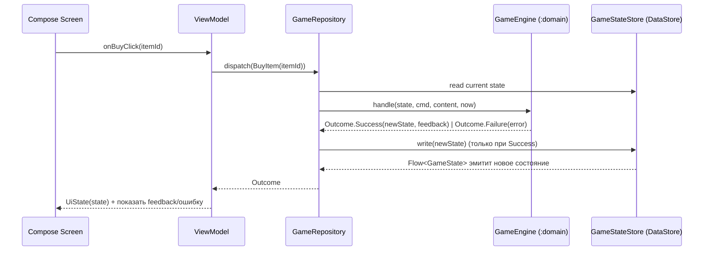

# 06 — Архитектура

## Главная идея: игра — это чистая функция

Вся бизнес-логика — модуль `:domain` на чистом Kotlin/JVM без Android. Он получает текущее
состояние и команду, возвращает новое состояние и объяснения. Ни корутин, ни базы, ни UI.

```
Outcome = GameEngine.handle(state: GameState, command: Command, content: Content, now: Long)
```

Это даёт:

- backend-разработчик пишет и тестирует весь `:domain` обычным JUnit, не открывая эмулятор;
- Android-разработчик пишет UI против стабильного API;
- критерий **ТЗ 8.2** «разделение логики, контента, хранения и UI» выполняется по построению;
- тесты экономики (**ТЗ 3.4**) — обычные unit-тесты без Android.

## Модули Gradle

```
finni-hackaton/
  app/        — Android: Compose UI, ViewModel, DataStore, загрузка assets, навигация
  domain/     — kotlin("jvm"): модели, движок, правила, оценщики заданий, валидатор контента
```

`:app` зависит от `:domain`. `:domain` не зависит ни от чего, кроме `kotlinx-serialization-json`
и `kotlinx-coroutines-core` (последний — только если нужен `Flow` для интерфейсов, лучше обойтись).

`settings.gradle.kts`: добавить `include(":domain")`. В `domain/build.gradle.kts`:

```kotlin
plugins {
    kotlin("jvm")
    kotlin("plugin.serialization")
}
dependencies {
    implementation("org.jetbrains.kotlinx:kotlinx-serialization-json:1.7.3")
    testImplementation(kotlin("test"))
}
```

## Слои внутри `:app`

```
ru.larpinovplay.finniapp
  FinniApp.kt                 — Application: создаёт AppContainer (ручной DI)
  di/AppContainer.kt          — ContentRepository, GameStateStore, GameRepository
  data/
    content/ContentRepository.kt   — читает assets/content/*.json → Content
    state/GameStateStore.kt        — DataStore<GameState>, JSON, атомарная запись
    GameRepository.kt              — единая точка: state Flow + dispatch(command)
  ui/
    navigation/NavGraph.kt
    home/HomeScreen.kt, HomeViewModel.kt
    budget/, shop/, savings/, tasks/, progress/, adult/, onboarding/, summary/
    components/                    — PetView, MoneyText, StatBar, FeedbackSheet
    theme/
```

Схема потока данных:



## API игрового движка (контракт между разработчиками)

```kotlin
// :domain
sealed interface Outcome {
    data class Success(val state: GameState, val feedback: List<FeedbackLine>) : Outcome
    data class Failure(val error: GameError) : Outcome
}

object GameEngine {
    fun handle(state: GameState?, command: Command, content: Content, now: Long): Outcome
    // state == null допустим только для Command.CreateProfile и ResetToDemo
}

data class Content(
    val config: EconomyConfig,
    val pets: PetCatalog,
    val items: List<Item>,
    val goals: List<Goal>,
    val tasks: List<Task>,
    val events: List<PeriodEvent>,
    val glossary: List<GlossaryEntry>,
    val feedback: Map<String, String>,
    val names: List<String>,
    val demoProfile: DemoProfile,
)
```

Внутри движок разбит по файлам, один на процесс из [03](03-processes.md):

```
domain/src/main/kotlin/ru/larpinovplay/finni/domain/
  model/            — data class-ы из 02
  engine/GameEngine.kt        — диспетчер: when(command) → handler
  engine/ProfileHandler.kt    — CreateProfile, ResetToDemo
  engine/PlanHandler.kt       — UpdatePlan, ConfirmPlan
  engine/ShopHandler.kt       — BuyItem + RecoveryOptions
  engine/SavingsHandler.kt    — Deposit, Withdraw, ChooseGoal, ReachGoal
  engine/TaskHandler.kt       — AnswerTask + оценщики по типу
  engine/PeriodHandler.kt     — ClosePeriod, StartPeriod
  engine/IncomeHandler.kt     — ClaimDailyBonus, AdultBonus
  rules/PetRules.kt           — состояние, подписи, стадии
  rules/GoalRules.kt          — remaining, eta
  rules/Ledger.kt             — Wallet.apply(tx)
  feedback/FeedbackBuilder.kt — шаблоны → FeedbackLine
  content/ContentValidator.kt
  query/                      — чистые функции для UI: taskStatus(), planVsFact(), moodExplanation()
```

Правило: движок — единственное место, где создаётся `Transaction` и меняется `Wallet`/`PetState`.
UI и репозиторий никогда не делают `state.copy(...)`.

## Хранение

**Решение для MVP:** весь `GameState` сериализуется в JSON и хранится в `DataStore<GameState>`
(Jetpack DataStore с собственным `Serializer` на `kotlinx.serialization`). Один файл, атомарная запись,
`Flow<GameState>` из коробки.

Почему не Room: данных мало (5–20 периодов, до 200 транзакций), состояние — один агрегат, который
меняется целиком одной командой. Транзакционность «всё или ничего» в DataStore бесплатна, в Room её
пришлось бы обеспечивать вручную через несколько таблиц. ТЗ 3.2 явно допускает «файловое хранилище».

Если объём вырастет — миграция на Room сводится к замене `GameStateStore` при том же интерфейсе.

`schemaVersion` в `GameState` нужен на случай изменения модели между сборками: при несовпадении
профиль сбрасывается с сообщением (для хакатона достаточно).

Настройки звука/анимации лежат в том же `GameState.settings`, отдельного `SharedPreferences` нет.

## Загрузка контента

`ContentRepository.load()` читает assets один раз при старте (в `Application` через `lazy` или в
splash-экране в фоне) — это десяток небольших JSON, укладывается в бюджет запуска 5 секунд
(**ТЗ 3.4**). Результат — неизменяемый `Content`, хранится в `AppContainer`.

В debug-сборке после загрузки вызывается `ContentValidator.validate(content)` и падает с понятным
сообщением. В release — только лог.

## Потоки

- Все команды выполняются последовательно в `GameRepository` через `Mutex`, чтобы два быстрых
  нажатия не породили гонку чтения/записи состояния.
- `dispatch` — `suspend`, вызывается из `viewModelScope`.
- Движок синхронный и быстрый (микросекунды), оборачивать в `Dispatchers.Default` не нужно;
  запись DataStore сама уходит в IO.

## ViewModel и UiState

Один `ViewModel` на экран. Каждый подписан на `GameRepository.state: StateFlow<GameState?>` и
превращает его в свой `UiState` чистыми функциями из `:domain/query`. Пример:

```kotlin
class HomeViewModel(private val repo: GameRepository, private val content: Content) : ViewModel() {
    val uiState: StateFlow<HomeUiState> = repo.state
        .map { it?.let { s -> HomeUiState.from(s, content) } ?: HomeUiState.Loading }
        .stateIn(viewModelScope, SharingStarted.WhileSubscribed(5_000), HomeUiState.Loading)

    private val _effects = Channel<UiEffect>()   // показать feedback, открыть диалог
    val effects = _effects.receiveAsFlow()

    fun closePeriod() = viewModelScope.launch {
        when (val r = repo.dispatch(Command.ClosePeriod)) {
            is Outcome.Success -> _effects.send(UiEffect.NavigateToSummary)
            is Outcome.Failure -> _effects.send(UiEffect.ShowError(r.error))
        }
    }
}
```

## Навигация

Jetpack Navigation 3: один `NavDisplay` (`presentation/navigation/MainNavigation.kt`), маршруты —
`@Serializable`-объекты, реализующие `NavKey` (`presentation/navigation/Routes.kt`). Back stack
сохраняется при повороте и смерти процесса. Экраны получают данные и колбэки, а переходы
между ними описаны только в `MainNavigation`. Итог задания и другие модальные окна — маршруты
с `DialogSceneStrategy.dialog()`.

У каждого экрана свой ViewModel (`koinViewModel()` внутри записи стека, живёт пока экран в стеке):
`private val _state = MutableStateFlow(...)` + `val state = _state.asStateFlow()`, действия через
`onAction`, разовые события (например, «задание принято») через `Channel` → `Flow`. Экран делится на
`XScreen` (берёт ViewModel, знает про навигацию только колбэки) и stateless `XScreenContent(state, onAction)`.
Общее состояние лежит не в ViewModel экрана, а в репозиториях (синглтоны Koin): `GameRepository`
и `SettingsRepository`. Их интерфейсы и модели живут в `domain`, реализации (пока в памяти,
позже DataStore/Room) — в `data`; ViewModel'ы подписываются на их `Flow`. В композиции остаётся только
эфемерный ввод (текст в поле, шаг степпера, раскрытие карточки).

Питомец — доменная модель `Pet` (`domain/pet`): имя, вид, `satiety`, `mood`, `growthPoints`; стадия и
«очков до следующей» выводятся из очков роста и не хранятся. Правила изменения (`changeSatiety`,
`changeMood`, `grow`) живут в самой модели. Питомец — часть игры и лежит в `GameSnapshot(state, pet)`
вместе с `GameState`: один агрегат, одна запись, поэтому экран не увидит новые монеты со старой сытостью (два
отдельных `Flow` через `combine` такое пропускали бы, даже с транзакцией в Room). В `UiState` кладём `pet: Pet`,
а не копии его полей. У каждого экрана `UiState` и `Action` — отдельные файлы, не внутри `XScreen.kt`.

Игра — чистые функции `GameEngine` в `domain/game/engine` (`(GameSnapshot, команда) → Transition`), без корутин
и Android. `GameRepository` (интерфейс в `domain`, `InMemoryGameRepository` в `data`) отдаёт `snapshot: StateFlow<GameSnapshot?>` (null, пока нет питомца:
игра начинается с `createPet`) и принимает команды `buy`, `deposit`, `chooseGoal`, `reachGoal`, `answerTask`, `finishWeek`; они идут по одной
(`Mutex`), результат пишется снимком целиком. Экраны, что открываются после создания питомца, берут игру через
`requireSnapshot()`. Справочники (`Content`: товары, цели, задания) — модели в `domain`
без картинок, данные в `data/content`; иконки и подписи UI подбирает `presentation` по `id`
(`ShopItem.icon`, `SavingsGoal.icon`). `AppSettings` и `SettingsRepository` (`observeSettings()`, `updateSettings { }`)
тоже в `domain`; хранение в Room — позже, интерфейс не изменится.

Текстов для ребёнка нет ни в `domain`, ни во ViewModel: они называют, что произошло, а слова берутся из контента.
Домен отдаёт типизированные причины (`LedgerReason` в записи журнала, факты `WeekSummary` с `grew`), ViewModel —
`HomeUiState.MoodExplanation` и `Tip`. Слой представления превращает их в текст функциями вроде `LedgerReason.text()`:
шаблон берётся по `FeedbackKey` из `Feedback` (`assets/content/feedback.json`, разбор — `data/content/FeedbackContent.kt`),
доступ из composable — через `LocalFeedback`, который задаёт `MainActivity`. Полноту ключей проверяют `Feedback`
при создании и `FeedbackContentTest`. Всё, что читает assets и потому требует `Context`, вынесено в `assetsModule`, чтобы
`appModule` поднимался в JVM-тесте (`AppModuleTest` достаёт все репозитории и ViewModel).

3D-питомец (SurfaceView) живёт в `PetHost` над `NavDisplay`, а не внутри `Home`: он создаётся один раз,
при уходе с главного экрана скрывается и ставится на паузу, при возврате продолжает с того же места.
Главный экран лишь резервирует под него слот (`PetHostState`).

Пока граф начинается с `Home`; выбор питомца идёт до него (`PetRoomScreen`: нет питомца →
создание, есть → граф). Когда появятся `Onboarding`/`CreateProfile`, они станут маршрутами и
стартовый ключ будет выбираться по наличию `GameState`. Полный граф в
[07-screens.md](07-screens.md#граф-навигации).

## DI

Ручной контейнер `AppContainer` в `Application`. Hilt не нужен для двух зависимостей и только
добавит время сборки и порог входа. `ViewModel` получают зависимости через `viewModel { }` фабрику.

## Зависимости, которые добавляем в `libs.versions.toml`

| Библиотека | Зачем |
|---|---|
| `kotlinx-serialization-json` | JSON контента и состояния |
| `androidx.datastore:datastore` (не preferences) | хранение `GameState` |
| `androidx.navigation3:navigation3-runtime`, `navigation3-ui` | навигация |
| `androidx.lifecycle:lifecycle-viewmodel-navigation3` | ViewModel, привязанная к записи стека |
| `androidx.lifecycle:lifecycle-viewmodel-compose` | `viewModel()` в Compose |
| `kotlinx-coroutines-test`, `turbine` (тесты) | тесты Flow |

Никаких аналитик, крашлитики, рекламы, сети. Ни одного runtime-разрешения в манифесте.

## Сборка релиза

- `applicationId = ru.larpinovplay.finniapp`, `minSdk = 27` (ТЗ просит Android 8.0 = API 26; при
  наличии времени опустить до 26), `targetSdk = 36`.
- Релизный keystore хранится **вне репозитория**, путь и пароли через `keystore.properties`
  в `.gitignore` или через переменные окружения. В README — инструкция по сборке APK.
- `isMinifyEnabled = false` для финальной сдачи (ТЗ 7.2 требует код без обфускации; APK всё равно
  подписан).
- Отдельный `buildConfigField("boolean", "DEMO_DEFAULT", ...)` для демо-сборки, которая стартует
  сразу в демо-режиме.

---

## Kotlin и Android для Java-разработчика

Это раздел для backend-разработчика. Ваша зона — `:domain` и контент: там нет ничего
андроидного, только Kotlin/JVM и JUnit. Ниже — соответствия, чтобы быстро читать чужой код.

### Kotlin vs Java

| Java | Kotlin | Комментарий |
|---|---|---|
| `record Point(int x, int y)` | `data class Point(val x: Int, val y: Int)` | `copy()` бесплатно: `p.copy(x = 5)` |
| `sealed interface` + `switch` pattern | `sealed interface` + `when` | `when` обязан быть исчерпывающим, компилятор проверит |
| `Optional<T>` / null-проверки | `T?`, `?.`, `?:`, `!!` | `state?.wallet ?: return` |
| checked exceptions | нет | ошибки домена возвращаем значениями (`Outcome.Failure`) |
| `static` | `object`, `companion object`, top-level функции | `GameEngine` — `object` |
| `final` по умолчанию нет | классы `final` по умолчанию | `open` чтобы наследовать; нам не нужно |
| Streams | `list.map { }`, `filter { }`, `sumOf { }` | лямбда в фигурных скобках, `it` — параметр |
| Jackson | `kotlinx.serialization` + `@Serializable` | аннотация на классе, плагин компилятора генерирует код |
| `CompletableFuture` | `suspend fun` + корутины | в `:domain` не используем вообще |
| Lombok `@Builder` | именованные аргументы и значения по умолчанию | `Period(index = 1, phase = PLANNING)` |
| `List<T>` изменяемый | `List<T>` неизменяемый, `MutableList<T>` | в домене только неизменяемые, новое состояние через `copy` и `+` |

`typealias Money = Int` — просто синоним для читаемости, не новый тип.

### Как устроен Android-слой (чтобы понимать, куда уходит ваш код)

| Понятие Spring/бэкенда | Аналог в приложении |
|---|---|
| Контроллер | `ViewModel`: принимает действия пользователя, отдаёт состояние экрана |
| Сервисный слой | наш `GameEngine` в `:domain` |
| Репозиторий / БД | `GameRepository` + `DataStore` (файл JSON на диске устройства) |
| Шаблон Thymeleaf/JSP | Compose: функция `@Composable fun HomeScreen(state: HomeUiState, onBuy: () -> Unit)`. Перерисовывается сама при изменении `state` |
| Reactive Streams / `Flux` | `Flow`, `StateFlow` — поток состояний, на который UI подписан |
| `application.properties` | `assets/content/config.json` — ваш контент |
| Запуск приложения | `Application.onCreate()` — один раз на процесс |
| Сессия | `GameState` в DataStore — переживает закрытие приложения (**ТЗ 2.5.13**) |
| Тест с Testcontainers | Instrumented-тест на эмуляторе. Вам не нужен: домен тестируется JUnit |

Важные отличия от сервера:

- Процесс приложения может быть убит системой в любой момент. Поэтому состояние пишем на диск
  после каждой команды, а не «при выходе».
- Один пользователь, одно устройство, нет конкурентных запросов. Но есть быстрые двойные нажатия —
  отсюда `Mutex` в репозитории.
- Нет «сервера правды»: если состояние на диске испорчено, восстановить неоткуда. Отсюда
  атомарная запись DataStore и `schemaVersion`.
- Главный поток нельзя блокировать: любой IO — через `suspend`. В `:domain` это не касается.

### Как запускать ваши тесты

```bash
./gradlew :domain:test
```

Без эмулятора, без Android SDK-зависимостей, секунды. Отчёт в `domain/build/reports/tests/test/index.html`.

### Что вы точно пишете

1. `:domain/model` — классы из [02](02-domain-model.md).
2. `:domain/engine` — обработчики команд по [03](03-processes.md) и [04](04-rules-and-formulas.md).
3. `:domain/content/ContentValidator`.
4. Весь контент в `app/src/main/assets/content/` по [05](05-content-model.md).
5. Тесты по [09](09-test-cases.md): на каждый процесс и на инварианты.
6. Разделы README про формулы, структуру данных, тест-кейсы (**ТЗ 5**).

Что вы не трогаете без пары: Compose, навигация, DataStore, Gradle-конфигурация `:app`.
