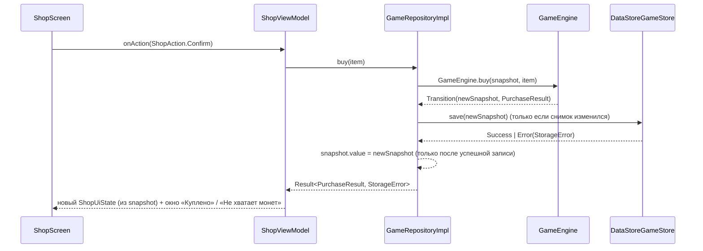

# 06 — Архитектура

## Главная идея: игра — это чистая функция

Правила игры — чистые функции на Kotlin без Android, корутин, базы и UI. Движок получает текущий снимок игры и
команду, возвращает новый снимок и результат, который нужно показать ребёнку:

```kotlin
object GameEngine {
    fun buy(game: GameSnapshot, item: ShopItem): Transition<PurchaseResult>
    // confirmPlan, deposit, withdraw, chooseGoal, reachGoal, answerTask, completeAdventure, finishWeek, wear, takeOff
}
data class Transition<out R>(val game: GameSnapshot, val result: R)
```

Это даёт:

- правила экономики проверяются обычными JUnit-тестами за секунды, без эмулятора (**ТЗ 3.4**);
- экраны пишутся против стабильного API и не содержат правил;
- «разделение логики, контента, хранения и UI» (**ТЗ 3.4, 8.2**) выполняется по построению.

## Модули и пакеты

Один Gradle-модуль `:app`. Слои разделены по пакетам `ru.larpinovplay.finniapp`, зависимости идут только внутрь:
`presentation` → `domain` ← `data`. `domain` не импортирует ни Android, ни `data`, ни `presentation`.

```
app/src/main/java/ru/larpinovplay/finniapp/
  app/
    FinniApp.kt              — Application: запускает Koin
    di/AppModule.kt          — Content, GameRepository, все ViewModel
    di/StorageModule.kt      — DataStoreGameStore (game.json), DataStoreSettingsRepository (settings.json)
    di/AssetsModule.kt       — Feedback из assets/content/feedback.json
  domain/                    — чистый Kotlin, без Android
    game/engine/GameEngine.kt    — все команды игры: (GameSnapshot, команда) → Transition
    game/engine/GameRules.kt     — числа экономики (docs/04)
    game/model/                  — GameState, GameSnapshot, BudgetPlan, LedgerEntry, WeekDeeds, WeekSummary, Trip, Tutorial…
    game/repository/GameRepository.kt — интерфейс репозитория игры
    pet/model/                   — Pet, PetSatiety, PetMood, PetGrowthStage, PetLook
    shop/                        — ShopItem, ShopCategory, WearableSlot, ShopRules (сколько стоит еда на неделю)
    goal/model/SavingsGoal.kt
    task/                        — Task, TaskPayload, TaskAnswer, TaskOutcome, Task.evaluate
    adventure/                   — Adventure, AdventureScene, AdventureRules (оплата, сдача, корзина)
    content/                     — Content, Feedback, FeedbackKey
    settings/                    — AppSettings, SettingsRepository
    storage/StorageError.kt, util/result/ — Result, EmptyResult, DomainError
  data/
    content/                 — учебный контент: задания, приключения, товары, цели (docs/05), разбор feedback.json
    game/GameRepositoryImpl.kt   — держит игру в памяти, пишет каждое изменение в GameStore
    game/store/              — GameStore, DataStoreGameStore, DTO сохранения и мапперы
    settings/                — DataStoreSettingsRepository, формат файла настроек
    storage/                 — общий JSON и обработка ошибок ввода-вывода
  presentation/
    MainActivity.kt          — тема, PetHost, экран создания питомца, навигация
    navigation/              — Routes (ключи экранов), MainNavigation (NavDisplay)
    screens/<экран>/         — XScreen, XViewModel, XUiState, XAction на каждый экран
    components/              — PetHost и PetModel3D (3D-питомец), RoomBackground, PetSounds, PetVoice, общие элементы
    game/, task/, pet/, …    — перевод доменных фактов в слова и иконки
    theme/                   — цвета, шрифт, тема
```

Схема потока данных на примере покупки:


```mermaid
sequenceDiagram
  participant UI as ShopScreen
  participant VM as ShopViewModel
  participant Repo as GameRepositoryImpl
  participant Engine as GameEngine
  participant Store as DataStoreGameStore

  UI->>VM: onAction(ShopAction.Confirm)
  VM->>Repo: buy(item)
  Repo->>Engine: GameEngine.buy(snapshot, item)
  Engine-->>Repo: Transition(newSnapshot, PurchaseResult)
  Repo->>Store: save(newSnapshot)   (только если снимок изменился)
  Store-->>Repo: Success | Error(StorageError)
  Repo-->>Repo: snapshot.value = newSnapshot (только после успешной записи)
  Repo-->>VM: Result<PurchaseResult, StorageError>
  VM-->>UI: новый ShopUiState (из snapshot) + окно «Куплено» / «Не хватает монет»
```

## Игровой движок

`GameEngine` (`domain/game/engine/GameEngine.kt`) — `object` с чистыми функциями, по одной на команду:

| Функция | Что делает | Процесс в [03](03-processes.md) |
|---|---|---|
| `newGame` | стартовые монеты, первая неделя в фазе плана | первый запуск |
| `confirmPlan` | подтверждает план, строка «Копилка» сразу уходит в копилку | план недели |
| `buy` | списывает монеты, меняет сытость и настроение, одежду кладёт в гардероб | покупка |
| `wear`, `takeOff` | надевает и снимает вещь из гардероба | гардероб |
| `chooseGoal`, `deposit`, `withdraw`, `reachGoal` | цель и копилка; цель-поездка отправляет питомца в поездку | накопления |
| `answerTask` | оценивает ответ (`Task.evaluate`), платит награду, считает лимит недели | задания |
| `completeAdventure` | засчитывает приключение недели и платит награду | приключения |
| `finishWeek` | дела недели → шаги роста, бонус копилки, недельное падение сытости и настроения, итоги, карманные | конец недели |

Правила:

- движок — единственное место, где создаётся запись журнала (`LedgerEntry`) и меняются кошелёк, копилка и питомец;
  экраны и репозиторий не делают `state.copy(...)`;
- команда, отклонённая правилами, возвращает тот же снимок и результат с причиной (`PurchaseResult.NotEnough`,
  `FinishWeekResult.Blocked`) — это не ошибка, а подсказка ребёнку;
- дата приходит параметром (`today: LocalDate`), поэтому движок не зависит от часов устройства;
- производные значения не хранятся, а считаются: стадия роста — из очков роста (`Pet.growthStage`), дела недели —
  из снимка (`GameSnapshot.weekDeeds`), шаг обучения — из игры (`GameState.tutorialStep`), статус задания —
  `GameState.taskStatus`.

Числа экономики — в `GameRules`, формулы — в [04](04-rules-and-formulas.md).

## Хранение

**Решение:** весь снимок игры (`GameSnapshot`: `GameState` + `Pet`) сериализуется в JSON и хранится в одном файле
через Jetpack DataStore с собственным сериализатором на `kotlinx.serialization`. Один файл, атомарная запись.

Почему не Room: данных мало (десятки недель, сотни записей журнала), состояние — один агрегат, который меняется
целиком одной командой. «Всё или ничего» в DataStore бесплатно, в Room его пришлось бы обеспечивать вручную через
несколько таблиц. ТЗ 3.2 явно допускает файловое хранилище. Если объём вырастет, миграция на Room сводится к замене
`GameStore` при том же интерфейсе.

**Как устроено.** Типизированный `DataStore<T>` (артефакт `androidx.datastore:datastore`) с JSON-сериализатором, не
protobuf. Слои:

- `domain`: `GameRepository` и `SettingsRepository`; команды возвращают `Result<..., StorageError>`. Исход по правилам
  игры (`PurchaseResult.NotEnough`) лежит внутри `Success`, сбой хранения — это `Error`.
- `data/game`: `GameRepositoryImpl` держит игру в памяти и пишет каждое изменение в `GameStore`. **Запись идёт до
  публикации**: `snapshot` меняется только после успешной записи, поэтому он равен тому, что на диске, а при сбое
  команда не применяется и возвращает `Error`. Отклонённая правилами команда ничего не пишет.
- `GameStore` — порт ввода-вывода в `data` (`load`, `save` целым снимком, `clear`): `DataStoreGameStore` в приложении,
  `InMemoryGameStore` в тестах. Отдельный порт нужен, чтобы репозиторий проверялся без диска и с подделанными сбоями.
- Формат файла — отдельные DTO (`GameSaveDto.kt`) и мапперы (`GameSaveMapper`), а не доменные модели: домен не знает о
  JSON. Имена причин журнала (`@SerialName`) и enum — часть формата.

**Ошибки DataStore не выходят за слой `data`:** `IOException` при чтении → `READ_FAILED`, при записи → `WRITE_FAILED`
(прежний файл цел: запись атомарна), нет места → `NO_SPACE`, нет доступа → `NO_ACCESS`. Повреждённый файл или чужая
версия: обработчик заменяет файл пустым сохранением, а `load()` один раз возвращает `CORRUPTED` или
`INCOMPATIBLE_VERSION`, чтобы игрок не терял игру молча. Версия (`GAME_SAVE_VERSION`) лежит в самом файле и читается
первой и отдельно, иначе смена формата выглядела бы как повреждение.

Настройки лежат в отдельном файле (`DataStoreSettingsRepository`, `settings.json`): сброс игры при смене формата не
должен трогать звук и подсказки. Их сбои мягкие: повреждённый файл или неудачное чтение дают значения по умолчанию,
сбой записи — `WRITE_FAILED`. Больше одного DataStore на файл в процессе создавать нельзя (в Koin — `single`).

**Подключение и показ ошибок.** `storageModule` создаёт оба хранилища на общей области ввода-вывода; в JVM-тесте
вместо них ставятся хранилища в памяти. При запуске `PetCreationViewModel` вызывает `game.load()`: есть игра → сразу
главный экран; нет → создание питомца; `CORRUPTED`/`INCOMPATIBLE_VERSION` → создание с пояснением (сохранение уже
сброшено); `READ_FAILED` → экран с кнопкой «Повторить», новую игру поверх не начинаем. Остальные ViewModel получают
результат команды через `orSnackbar { … }` (`presentation/storage/StorageErrorUi.kt`): о сбое, который пользователь
может исправить сам (`NO_SPACE`, `NO_ACCESS`), говорит сообщение внизу экрана с кнопкой «Повторить»; при остальных
игра просто остаётся в прежнем, сохранённом состоянии.

Файлы лежат в `files/datastore/` и не попадают ни в облачную копию, ни в перенос на новое устройство
(`allowBackup="false"` + `res/xml/data_extraction_rules.xml`): сброс профиля удаляет данные полностью.

## Контент

Учебный контент — неизменяемый `Content` (`domain/content/Content.kt`): товары, цели, задания, приключения. Данные
лежат в `data/content/*.kt`, Koin отдаёт их синглтоном. Фразы для ребёнка — `assets/content/feedback.json`, читаются
один раз при старте (`assetsModule`). Подробно — [05](05-content-model.md).

## Потоки

- Все команды выполняются последовательно в `GameRepositoryImpl` под `Mutex`, чтобы два быстрых нажатия не породили
  гонку чтения и записи.
- Команды репозитория — `suspend`, вызываются из `viewModelScope`.
- Движок синхронный и быстрый (микросекунды), оборачивать его в `Dispatchers.Default` не нужно; запись DataStore сама
  уходит в `Dispatchers.IO` (область `storageScope`).

## ViewModel и UiState

Один ViewModel на экран. Общее состояние лежит не в ViewModel, а в репозиториях-синглтонах: `GameRepository.snapshot:
StateFlow<GameSnapshot?>` (null, пока питомца нет) и `SettingsRepository.observeSettings()`. ViewModel подписывается на
них и собирает свой `UiState`:

```kotlin
class HomeViewModel(private val game: GameRepository, private val content: Content, settings: SettingsRepository) : ViewModel() {
    private val _state = MutableStateFlow<HomeUiState?>(null)
    val state: StateFlow<HomeUiState?> = _state.asStateFlow()

    init {
        viewModelScope.launch {
            combine(game.snapshot.filterNotNull(), settings.observeSettings()) { snapshot, s -> snapshot to s }
                .collect { (snapshot, s) -> _state.update { toUiState(snapshot.pet, snapshot.state, s, game.finishBlock(), it) } }
        }
    }

    fun onAction(action: HomeAction) { /* when (action) { … } → game.confirmPlan(…).orSnackbar { … } */ }
}
```

Соглашения:

- `private val _state = MutableStateFlow(...)` + `val state = _state.asStateFlow()`; все действия экрана — одна
  функция `onAction(action: XAction)`; разовые события (итог задания, закрыть экран) — через `Channel` → `Flow`.
- Экран делится на `XScreen` (берёт ViewModel через `koinViewModel()`, знает про навигацию только колбэки) и stateless
  `XScreenContent(state, onAction)` для превью и тестов. `UiState` и `Action` — отдельные файлы.
- В `UiState` кладём доменные модели (`pet: Pet`), а не копии их полей. В композиции остаётся только эфемерный ввод
  (раскрытие карточки, шаг ползунка).
- Питомец лежит в `GameSnapshot(state, pet)` вместе с игрой: один агрегат, одна запись, поэтому экран не увидит новые
  монеты со старой сытостью.
- Экраны, которые открываются после создания питомца, берут игру через `requireSnapshot()`.

Текстов для ребёнка нет ни в `domain`, ни во ViewModel: они называют, что произошло, а слова берутся из контента.
Домен отдаёт типизированные причины (`LedgerReason` в записи журнала, факты `WeekSummary`), ViewModel — перечисления
вроде `HomeUiState.Speech`. Слой представления превращает их в текст функциями вроде `LedgerReason.text()`: шаблон
берётся по `FeedbackKey` из `Feedback`, доступ из composable — через `LocalFeedback`, который задаёт `MainActivity`.
Иконки и подписи товаров и целей `presentation` подбирает по `id` (`ShopItem.icon`, `SavingsGoal.icon`).

## Навигация

Jetpack Navigation 3: один `NavDisplay` (`presentation/navigation/MainNavigation.kt`), маршруты — `@Serializable`
объекты и классы, реализующие `NavKey` (`presentation/navigation/Routes.kt`). Back stack сохраняется при повороте и
смерти процесса. Экраны получают данные и колбэки, а переходы между ними описаны только в `MainNavigation`. Итог
задания — маршрут-диалог (`DialogSceneStrategy.dialog()`).

Граф начинается с `Home`. Знакомство с Финни (приветствие, раскраска, имя, три урока) идёт до графа:
`PetCreationScreen` в `MainActivity` показывает создание, пока игры нет, и граф — когда она есть. Полный граф —
[07](07-screens.md#граф-навигации) и комментарий в `Routes.kt`.

## 3D-питомец

3D-питомец (SurfaceView + Filament) живёт в `PetHost` в корне приложения (`MainActivity`), над экраном создания
питомца и над `NavDisplay`, а не внутри `Home`: модель, движок Filament и фаза анимации должны пережить уход главного
экрана из композиции. Вид и движок создаются один раз, сразу после первого кадра. Экран, который показывает питомца
(создание, главный, гардероб), пишет в `PetHostState`, какую модель показать и где её слот; хост двигает вид на слот
и прячет его, когда экран уходит. Ограничения, на которых это держится:

- Прятать вид нужно сдвигом за экран и паузой отрисовки, а не через `visibility`: невидимый SurfaceView теряет
  поверхность, а создавать её заново дорого. Сдвиг заодно убирает вид из hit-теста Compose. Элементы экрана под
  питомцем принимают нажатия через `Modifier.petShield`.
- Размер SurfaceView менять нельзя: после смены размера Filament продолжает рисовать в старый буфер, и питомец
  пропадает. Поэтому буфер фиксированный (квадрат 1024 px, `setFixedSize`), слот квадратный, а система масштабирует
  буфер под размер вида.
- SurfaceView не следует за анимацией Compose, поэтому переходы между экранами — только затухание 150 мс
  (`MainNavigation`). Питомец показывается, как только экран становится целью перехода.
- `Engine` Filament привязан к потоку, который его создал, поэтому модель грузится на главном потоке.
- Быстрый первый показ: пока экран не сообщил, какой питомец нужен, вид стоит за экраном и ничего не рисует; карта
  теней выключена (тень на полу рисует `PetHost` отдельно), а приветствие ждёт первого показанного кадра через
  `Fence`, не блокируя главный поток.
- Свёрнутое приложение ставит отрисовку, звуки и микрофон на паузу (жизненный цикл в `PetHost`).
- Версия Filament закреплена на 1.71.5: на 1.76.1 не работает взмах руки по нажатию (см. `libs.versions.toml`).

Модели по стадиям роста — `assets/cat/{baby,teen,adult}.glb`, раскраски — `assets/cat/skins/`, какие клипы на что —
`presentation/pet/PetAssets.kt`. Фон комнаты снят той же камерой (`PET_CAMERA_DISTANCE`), поэтому кот стоит на полу
(`RoomBackground`).

## DI

Koin: `appModule` (контент, `GameRepository`, все ViewModel), `storageModule` (файлы на диске, требует Context) и
`assetsModule` (чтение assets, требует Context). Разделение нужно, чтобы `appModule` поднимался в JVM-тесте
(`AppModuleTest` достаёт все репозитории и ViewModel). ViewModel с параметром (задание, приключение) получают его
через `parametersOf`.

## Зависимости

Полный список с версиями и лицензиями — [licenses.md](licenses.md#библиотеки). Никаких аналитик, крашлитики, рекламы,
платёжных SDK и сети.

## Разрешения Android (ТЗ 3.1 п. 4, 3.4, 3.5)

| Разрешение | Зачем | Когда запрашивается |
|---|---|---|
| `RECORD_AUDIO` | Дополнительная функция «Кот повторяет слова»: питомец слушает микрофон и повторяет фразу своим голосом (`PetVoice`) | Только когда функцию включают переключателем «Кот повторяет слова» в настройках. По умолчанию функция выключена, главный экран доступ сам не запрашивает |

Других разрешений нет, в том числе `INTERNET`. Обязательный сценарий работает без разрешений. Звук с микрофона
обрабатывается только на устройстве: он не записывается в файлы, не хранится и никуда не отправляется. Если в доступе
отказали, переключатель остаётся выключенным и подсказывает, что доступ можно выдать в настройках телефона.

## Сборка релиза

- `applicationId = ru.larpinovplay.finniapp`, `minSdk = 26` (Android 8.0, ТЗ 3.1), `targetSdk = 37`,
  `versionName = 1.0`, `versionCode = 1`.
- `isMinifyEnabled = false`: ТЗ 7.2 требует код без обфускации.
- Подпись в сборку не встроена: ключ команды хранится **вне репозитория**, APK подписывается `apksigner` после
  `assembleRelease` ([README](../README.md#релизная-сборка)). `keystore.properties`, `*.jks` и `*.keystore` — в
  `.gitignore`.

## Тесты

```bash
./gradlew :app:testDebugUnitTest
```

Без эмулятора, секунды. Отчёт — `app/build/reports/tests/testDebugUnitTest/index.html`. Тесты движка —
`GameEngineTest`, экономики — `EconomyBalanceTest`, контента — `ContentMinimumsTest`, `AdventureContentTest`,
`FeedbackContentTest`.
