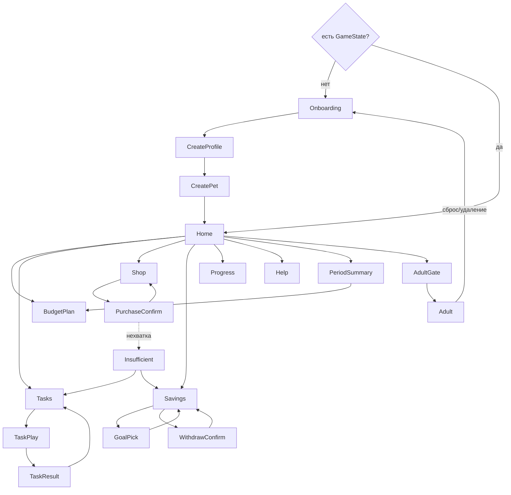

# 07 — Экраны и навигация

## Граф навигации

Кнопка «Назад» всегда слева сверху, одинаковая на всех экранах, ведёт на `Home`
(кроме вложенных: TaskPlay → Tasks, PurchaseConfirm → Shop). Системный «назад» делает то же.

## Правила UX для всех экранов (ТЗ 3.6)

| Правило | Как проверяем |
|---|---|
| Кнопки и тапаемые элементы ≥ 48 × 48 dp | `Modifier.minimumInteractiveComponentSize()` включён в Material 3 по умолчанию; не отключать |
| Основной текст ≥ 16 sp, масштабируется системно | размеры в `sp`, проверка при шрифте 200 % в настройках устройства |
| Цвет не единственный носитель смысла | у каждого статуса иконка + подпись: ✓/○, «Нужное»/«Желаемое» текстом, шкалы с числом |
| Короткие фразы | заголовок ≤ 5 слов, подсказка ≤ 12 слов, кнопка 1–2 слова |
| Одно действие на экране очевидно | одна крупная основная кнопка, остальное второстепенно |
| Подтверждение опасных действий | закрытие периода, снятие из копилки, смена цели, сброс, удаление |
| Звук и анимации отключаемы | `Settings.soundEnabled`, `Settings.animationsEnabled`; критичная информация всегда текстом |
| Портрет, ширина от 360 dp | проверка на эмуляторе 360 × 640 и на физическом устройстве |
| Контраст текста ≥ 4.5:1 | Material 3 цветовая схема, проверка Accessibility Scanner |

## Экраны

### Onboarding
- 3 карточки с иллюстрацией и 1–2 фразами. Точки-индикатор, «Дальше», «Пропустить».
- Карточка 2 — три типа решений с иконками: нужное 🍎, желаемое 🎈, копилка 🐷 (иконки — свои ассеты, не эмодзи).
- Повторно открывается из `Help`.

### CreateProfile
- Заголовок «Придумай игровое имя». Поле ввода, подсказка «Не настоящее имя», кнопка «Случайное».
- Валидация: 1..16 символов. Кнопка «Дальше» неактивна пока пусто.

### CreatePet
- Большое превью питомца. Ряд из 3 видов, ряд из 3 окрасов (кружки с подписью). Поле имени + «Случайное».
- «Готово!» → `CreateProfile` команда → Home.

### Home — главный экран (ТЗ 2.5.3)
Всё одновременно, без прокрутки на 360 × 640:
- шапка: имя ребёнка, кнопка «?» (Help), кнопка «Для взрослых» (маленькая, текстом);
- питомец с выражением по настроению, под ним фраза-объяснение состояния;
- три шкалы: сытость, уход, настроение — иконка, подпись, число, полоса;
- карточка «Монеты: N» и «Копилка: M / цель K» (или «Выбери цель»);
- плашка «Неделя n · План составлен / Составь план» → BudgetPlan;
- карточка активного задания (первое доступное) → TaskPlay;
- нижняя навигация: План · Задания · Магазин · Копилка · Прогресс;
- кнопка «Завершить неделю» (видна только в фазе ACTIVE).
В демо-режиме — плашка «Демо» в шапке.

### BudgetPlan
- Фаза PLANNING: доступно N, три степпера ± по 5 с подписями и иконками, строка «Осталось: X»,
  кнопка «Подтвердить план». Подсказка про стоимость нужного.
- Фаза ACTIVE: три строки «план / факт» с прогресс-барами, «Дополнительно заработано: Y»,
  подсказка «План можно поменять на следующей неделе».

### Tasks
- Три секции по темам. Карточка: название, награда «+20», статус текстом («Доступно», «Выполнено ✓»,
  «Попробуй снова», «На следующей неделе»).

### TaskPlay
- `intro` крупно, иллюстрация, затем виджет по типу:
  - CHOICE — список крупных кнопок-вариантов;
  - ALLOCATE — три степпера, сумма и остаток;
  - SHOP_LIST — список товаров с чекбоксами, «Итого / Бюджет».
- Кнопка «Подсказка» показывает `hint`. Кнопка «Готово» активна, когда ответ валиден
  (ALLOCATE: сумма = total; SHOP_LIST: хотя бы один товар).

### TaskResult
- Иконка ✓ или «почти», текст последствия (`consequence`/`explanation*`), «Монеты +N», «Понятно».

### Shop
- Вкладки «Нужное» / «Желаемое». Чек-лист недели над «Нужным».
- Карточка товара: картинка, название, цена, эффект текстом («Сытость +40»), `childHint`.
- Товары дороже баланса не прячем и не блокируем: ребёнок должен попробовать и получить объяснение (шаг 7).

### PurchaseConfirm
- Товар, «Цена N», «Категория: Нужное», «Эффект: …», «Останется: balance − N».
- При выходе за план — предупреждение текстом с иконкой. Кнопки «Купить» / «Не сейчас».
- После покупки — карточка обратной связи (FeedbackSheet), возврат в Shop.

### Insufficient
- «Не хватает N монет». Список вариантов из `RecoveryOption` как кнопки, каждая ведёт на нужный экран.

### Savings
- Нет цели: сетка из 3 целей → GoalPick (подтверждение).
- Есть цель: карточка (картинка, название, «Накоплено M из K», прогресс-бар, «≈ N недель»),
  степпер «Отложить» + кнопка, «Взять из копилки» (если M > 0), «Поменять цель».
- При M ≥ K: большая кнопка «Получить!» → экран праздника.

### WithdrawConfirm
- Степпер суммы, блок «Было M → станет M−a», «Срок: было ≈ N → станет ≈ N′», кнопки «Да, взять» / «Оставить».

### PeriodSummary
- «Неделя n закончена». Три строки план/факт. Три критерия с иконками и фразами. «Настроение: +10».
- Если стадия выросла — отдельный блок «Финни подрос!» с анимацией (если включена) и текстом.
- Кнопка «Новая неделя» → BudgetPlan.

### Progress
- Стадия и очки до следующей. Цель. Список заданий по темам с галочками. Итоги последней недели.
  Журнал операций текущей недели (иконка, название, ±сумма).

### Help
- Три карточки онбординга + глоссарий (аккордеон термин → текст).

### AdultGate
- «Раздел для взрослых. Реши пример: 17 + 26 = ?», поле, «Проверить». 3 попытки → новый пример.

### Adult
- Цели приложения (6 пунктов). Пройденные темы (3 строки с числом заданий). Общий прогресс.
- Бонус от взрослого (опционально). Переключатели «Звук», «Анимации».
- «Демо-режим: включить / сбросить». «Сбросить профиль», «Удалить все данные» — оба с диалогом
  подтверждения, в котором написано, что именно исчезнет.

## Ключевые экраны для промежуточной сдачи (ТЗ 7.1)

Минимум три: `CreatePet`, `Home`, `BudgetPlan` или `Savings`. Их делаем первыми.

### Реализация родительского раздела

`AdultScreen` открывается из замка на Home. При каждом новом входе требуется решить сумму
двух двузначных чисел; после трёх неверных ответов генерируется новый пример. Внутри доступны
шесть целей обучения, прогресс трёх тем, стадия питомца, завершённые недели и цели, баланс и
накопления, общие настройки звука и анимаций.

Демо заменяет текущую игру профилем «Финни Демо» (заяц, 100 монет, неделя 1), помечает Home
плашкой «Демо» и допускает повторный сброс. Все игровые недели завершаются вручную без ожидания.
Сброс профиля очищает игру и возвращает к созданию питомца; удаление всех данных дополнительно
сбрасывает звук, анимации и подсказки. Каждое из этих действий требует отдельного подтверждения.
Дополнительные баллы от взрослого (опциональны по ТЗ) пока не реализованы.

Ограничение текущего прототипа: игра и настройки хранятся в памяти процесса; постоянное хранение
после перезапуска ещё не реализовано. Проверки родительского раздела: `:app:testDebugUnitTest`.
