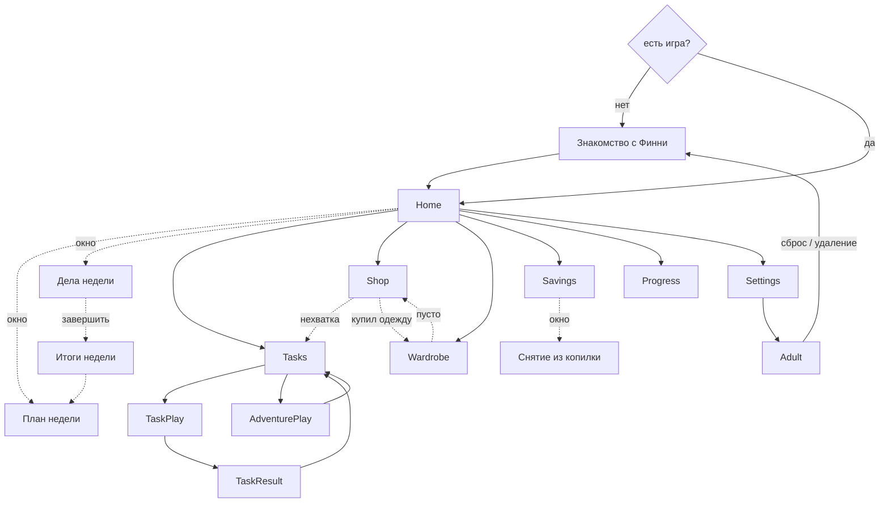

# 07 — Экраны и навигация

## Граф навигации

```mermaid
flowchart TD
  Start{есть игра?} -- нет --> Creation[Знакомство с Финни] --> Home
  Start -- да --> Home
  Home -. окно .-> Plan[План недели]
  Home -. окно .-> Deeds[Дела недели] -. завершить .-> Summary[Итоги недели] -.-> Plan
  Home --> Tasks --> TaskPlay --> TaskResult --> Tasks
  Tasks --> AdventurePlay --> Tasks
  Home --> Shop
  Shop -. нехватка .-> Tasks
  Shop -. купил одежду .-> Wardrobe
  Home --> Wardrobe -. пусто .-> Shop
  Home --> Savings -. окно .-> Withdraw[Снятие из копилки]
  Home --> Progress
  Home --> Settings --> Adult
  Adult -- сброс / удаление --> Creation
```

Знакомство с Финни идёт до графа (`PetCreationScreen` в `MainActivity`). Граф начинается с `Home`, маршруты —
`presentation/navigation/Routes.kt`, переходы — только в `MainNavigation.kt`. Окна (план, дела, итоги, покупка,
снятие) — диалоги своих экранов, итог задания — маршрут-диалог.

Кнопка «Назад» одна на все разделы: круглая, слева сверху в шапке `ScreenHeader`, с описанием «Назад» для TalkBack.
Она и системный «назад» снимают верхний экран: разделы ведут на главный, задание и приключение — на «Задания».

## Правила UX для всех экранов (ТЗ 3.6)

| Правило | Как соблюдаем и проверяем |
|---|---|
| Кнопки и нажимаемые элементы ≥ 48 × 48 dp | кнопки меню, строки настроек, кнопки окон от 48 dp; Material 3 `minimumInteractiveComponentSize` не отключаем |
| Основной текст ≥ 16 sp, масштабируется системно | основной текст (`bodyLarge`) 16 sp, заголовки 18–28 sp, всё в `sp`. Меньше 16 sp — только вторичные подписи на карточках (цена, «копим», подпись под иконкой меню) и плашки: они дублируют крупный текст или иконку, а на экране 360 dp не помещаются крупнее. Проверка при шрифте 200 % — в плане ([10](10-team-plan.md)) |
| Цвет не единственный носитель смысла | у состояний есть слово или иконка: «Вкл/Выкл», «копим», «надето», галочки дел, «Сверх плана», числа у шкал |
| Короткие фразы | реплики Финни — одна фраза, кнопки — 1–3 слова |
| Одно действие на экране очевидно | одна крупная бирюзовая кнопка, остальное второстепенно |
| Подтверждение действий, меняющих прогресс | покупка, снятие из копилки, смена цели, демо, сброс, удаление |
| Звук и анимации отключаемы | «Настройки» → «Звуки», «Анимации» (`AppSettings`); важное всегда дублируется текстом |
| Портрет, ширина от 360 dp | проверка на экране 360 × 640 — в плане ([10](10-team-plan.md)) |
| Контраст текста ≥ 4.5:1 | тёмный текст на кремовых карточках; белый заголовок раздела — с тенью поверх комнаты |

## Экраны

### Знакомство с Финни (`PetCreationScreen`) — ТЗ 2.5.1, 2.5.2
- 3D-Финни в центре, реплика над ним, кнопка шага снизу, сверху — «назад», лапки прогресса, «Пропустить» на уроках.
- Шаги: «Привет» → раскраска (9 кружков, кот перекрашивается сразу) → имя (поле до 16 символов, по умолчанию
  «Финни») → уроки «Карманные монеты», «Дела недели», «Цель» → «Начнём!».
- Если сохранение повреждено или не читается — пояснение или «Повторить».

### Главный экран (`HomeScreen`) — ТЗ 2.5.3
Всё одновременно, без прокрутки:
- сверху: сытость и настроение (кольца с иконками), монеты, шестерёнка «Настройки»;
- карточки: «В копилке N» с целью (или «Цель не выбрана») и активное задание (сначала приключение недели);
- слева: кнопки «Прогресс» и «План недели», плашка «Демо» в демо-режиме;
- в центре: 3D-Финни в своей комнате; реплика-подсказка над головой, «…» — свёрнутая реплика;
- снизу: меню «Задания», «Магазин», солнышко «Дела недели» (сделано из 4), «Гардероб», «Копилка».
- Нажатие на монеты, сытость или настроение объясняет, от чего они зависят (`HomeInfoDialog`).
- Первая неделя нового питомца — обучение по шагам с подсветкой нужной кнопки.

### Окно «План недели» (`WeekPlanDialog`) — ТЗ 2.5.5
- Монеты недели, три строки (обязательное, необязательное, копилка) с «+», «−» и ползунком, шаг 5.
- Подсказка «Финни на еду нужно хотя бы 20», «Осталось разложить: N», «Сразу отправятся в копилку».
- «Начать неделю» — когда разложено всё.

### Окно «Дела недели» (`DeedsDialog`) и итоги недели (`WeekSummaryDialog`) — ТЗ 2.5.9, 2.5.10
- Четыре дела с отметками и подсказкой, что осталось сделать; «Завершить неделю» или объяснение, почему пока нельзя.
- Итоги: дела, план и факт, бонус копилки, настроение, «Финни подрос!», шаги до следующей стадии, монеты на новую
  неделю.

### Задания (`TasksScreen`) — ТЗ 2.5.8
- Сверху — приключение недели. Ниже задания по трём темам: название, награда, статус словами («Сделано»,
  «Попробуй на следующей неделе», «На этой неделе хватит»).

### Задание (`TaskPlayScreen`) и итог (`TaskResultCard`)
- Ситуация крупно, затем механика: варианты-кнопки / кучки с «+» и «−» / список покупок с суммой и остатком.
  «Подсказка», «Готово».
- Итог: верно или нет, что произошло и почему, сколько монет пришло, «Понятно».

### Приключение (`AdventureScreen`)
- Сюжет по шагам в карточках: история, оплата купюрами (`PayScene`), сдача, выбор, корзина (`BasketScene`).
  После ошибки — объяснение и можно исправить. В конце — награда.

### Магазин (`ShopScreen`) — ТЗ 2.5.6
- Вкладки «Обязательное» и «Необязательное», над списком — сколько осталось по строке плана.
- Карточка товара: картинка, название, цена, эффект, подсказка. Товары дороже баланса не прячем: ребёнок должен
  попробовать и получить объяснение (шаг 7).
- Окно покупки: категория и цена, «Финни получит», «Останется монет», «По плану останется» или «Сверх плана»,
  «Купить».
- «Куплено»: что изменилось. «Не хватает N монет»: что можно сделать — взять из копилки, заработать на задании,
  выбрать дешевле, подождать.

### Гардероб (`WardrobeScreen`)
- 3D-Финни сверху, снизу наклейки по местам: голова, глаза, шея. Нажатие — надеть или снять; пустое место ведёт в
  магазин.

### Копилка (`SavingsScreen`) — ТЗ 2.5.7
- Кольцо цели: картинка, «накоплено из стоимости», «Осталось N · примерно M нед.»; «Отложить», «Забрать из
  копилки», «Достичь цели!», когда хватает.
- Без цели — «На что будем копить?». Ниже — все цели плитками; смена цели — окно «Новая цель?».
- Окно снятия (`WithdrawDialog`): сумма, сколько останется в копилке и насколько отодвинется цель, подтверждение.
- Праздник «Цель достигнута!» и что это дало Финни.

### Прогресс (`ProgressScreen`) — ТЗ 2.5.11
- Рост (лесенка стадий, шаги до следующей), цель, прошлая неделя (дела, план и факт), задания по темам,
  достигнутые цели, «Монеты этой недели» (журнал).

### Настройки (`SettingsScreen`)
- Переключатели «Звуки», «Анимации», «Подсказки», «Кот повторяет слова» — со словами «Вкл/Выкл».
- «Как играть» (карточки знакомства), «Словарик», «О приложении», вход «Для взрослых».

### Для взрослых (`AdultScreen`) — ТЗ 2.5.12
- Барьер: пример «a + b = ?», 3 попытки, потом новый пример.
- «Чему учится ребёнок», «Общий прогресс», «Пройденные темы», настройки звука и анимаций.
- «Включить демо» / «Сбросить демо», «Сбросить профиль», «Удалить все данные» — каждое с окном подтверждения, в
  котором написано, что именно исчезнет.

## Ключевые экраны для промежуточной сдачи (ТЗ 7.1)

Знакомство с Финни (создание питомца), главный экран, план недели и копилка.
